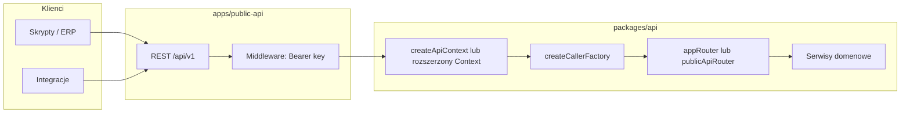

# Plan: Public API dla Enterprise (bez przepisywania logiki tRPC)

## Stan obecny

- Cała logika biznesowa jest w [`packages/api`](packages/api) jako routery tRPC scalone w [`packages/api/src/root.ts`](packages/api/src/root.ts).
- Sesja użytkownika i organizacja: [`packages/api/src/context.ts`](packages/api/src/context.ts) + [`packages/api/src/middleware/tenant.ts`](packages/api/src/middleware/tenant.ts) (wymaga `ctx.session.session.activeOrganizationId`).
- Tier Enterprise jest już zdefiniowany w planach ([`packages/api/src/routers/billing.ts`](packages/api/src/routers/billing.ts)) i istnieje [`enterpriseProcedure`](packages/api/src/middleware/tier.ts) (`requireTier('ENTERPRISE')`).
- RBAC opiera się o Better Auth [`hasPermission`](packages/api/src/middleware/rbac.ts) z nagłówków cookie — **klucz API nie przejdzie tego samego flow bez rozszerzenia**.
- Testy i SSR już używają [`createCallerFactory(appRouter)`](packages/api/src/init.ts) — ten sam mechanizm posłuży do wywołań „serwer-serwer” z warstwy REST.

## Kierunek architektury

**Zasada:** REST to tylko adapter (routing, walidacja wejścia JSON, mapowanie błędów HTTP, rate limit, wersjonowanie). Implementacja pozostaje w `packages/api` (procedury lub serwisy wywoływane z procedur).

## 1. Model auth: klucze organizacji (M2M)

- Nowa encja w Prisma (np. `OrganizationApiKey`): `organizationId`, hash sekretu (np. argon2/bcrypt), prefix do identyfikacji, nazwa, opcjonalnie `scopes[]`, `createdByUserId`, `revokedAt`, `lastUsedAt`.
- Generacja klucza jednorazowo przy utworzeniu (plaintext tylko w odpowiedzi), dalej tylko hash.
- Nagłówek: `Authorization: Bearer <key>` (lub `X-Api-Key` — ujednolicić w dokumentacji).

**Tier:** przy walidacji klucza wymusić subskrypcję `ENTERPRISE` (ACTIVE/TRIALING) — spójnie z [`getSubscription`](packages/api/src/services/billing-service.ts) jak w [`requireTier`](packages/api/src/middleware/tier.ts).

## 2. Rozszerzenie kontekstu i middleware (najważniejszy techniczny krok)

Obecny [`tenantMiddleware`](packages/api/src/middleware/tenant.ts) wymaga sesji Better Auth. Trzeba **wspólnej ścieżki „tenant scope”**:

- Wyciągnąć logikę ustawiania `organizationId`, `region`, `db`, `tenantStore.run(...)` do funkcji współdzielonej (np. `runWithTenantContext(orgId, next)`).
- Rozszerzyć typ `Context` o opcjonalne pole np. `authMode: 'session' | 'apiKey'` oraz metadane klucza (`apiKeyId`, `scopes`).
- Nowy łańcuch procedur np. `apiKeyTenantProcedure`:
  - walidacja klucza → `organizationId` → ta sama konfiguracja `db` co dla użytkownika;
  - `requireTier(ENTERPRISE)`;
  - zamiast `requirePermission` z cookie: **middleware sprawdzający scopes** (np. `contractor:read`) albo wywołanie `hasPermission` tylko w trybie sesji.

[`requirePermission`](packages/api/src/middleware/rbac.ts) należy uogólnić: jeśli `ctx.authMode === 'apiKey'`, sprawdzać `scopes` zamiast `authApi.hasPermission`. Dzięki temu te same procedury mogą być używane z UI i z API — o ile są podpięte pod procedurę z tym middleware (stopniowa migracja).

Alternatywa przy wąskim MVP: osobny **`publicApiRouter`** tylko z procedurami opartymi o `apiKeyTenantProcedure` + jawne scopes — bez dotykania całego `appRouter` na start.

## 3. Powierzchnia REST: nowa aplikacja w monorepo

- Dodać np. [`apps/public-api`](apps/public-api) (Node 24): lekki framework (Hono lub Fastify — w root [`package.json`](package.json) są już overrides pod `hono`).
- Endpointy wersjonowane: `/api/v1/...`, JSON, jednolite kody błędów (401/403/404/429/422).
- Handler: parsuje request → buduje `Headers`/kontekst → `createCallerFactory(chosenRouter)(await createApiContext(...))` → wywołanie procedury → mapowanie wyniku na JSON.

**Dlaczego osobna app (zgodnie z Twoją intencją):** osobny deploy, limity, WAF, dokumentacja i klucze nie mieszają się z Next; można podłączyć ten sam obraz/binarkę pod inną domeną (`api.*`).

**Alternatywa (jeśli kiedyś uproszczecie ops):** te same handlery jako route handlers pod [`apps/web/src/app/api/v1/...`](apps/web) — logika w `packages/api` pozostaje identyczna.

## 4. Co udostępnić klientom (zakres produktowy)

Zacząć od **wąskiego, sensownego zestawu** (read-heavy + jasne mutacje), np.:

- kontraktorzy: list / get (zgodnie z istniejącymi inputami w [`contractor` router](packages/api/src/routers/contractor.ts));
- faktury: list / get / status;
- dokumenty: metadane + presigned URL jeśli już jest w warstwie dokumentów;
- webhooks wychodzące (jeśli macie lub planujecie) — osobna historia.

Pełne „wszystko co w aplikacji” przez REST zwykle nie jest ani bezpieczne, ani utrzymywalne; lepiej publiczna powierzchnia + ewentualnie GraphQL/REST rozszerzenia na żądanie.

## 5. DX dla klientów

- OpenAPI 3.1 wygenerowane z ręcznie utrzymywanych definicji lub z generatora tras (np. `@hono/zod-openapi` jeśli Hono) — **spójne z walidatorami** z [`packages/validators`](packages/validators) tam gdzie to możliwe.
- UI ustawień w [`apps/web`](apps/web): tworzenie/rotacja/revoke kluczy (procedury tRPC tylko dla adminów org — [`adminProcedure`](packages/api/src/middleware/rbac.ts)).

## 6. Bezpieczeństwo i observability

- Rate limiting per klucz i per org (Redis — macie cache w projekcie).
- Audit: actor `api_key` (w PRD wspominany jest typ aktora) przy mutacjach.
- Nie eksponować wewnętrznych ścieżek tRPC na zewnątrz; wersjonowanie URL.

## Kolejność implementacji (sugerowana)

1. Schema + migracja Prisma + serwis walidacji klucza.
2. Refactor tenant context + `requirePermission` z rozgałęzieniem session vs apiKey scopes.
3. `publicApiRouter` (kilka procedur) + testy jednostkowe callerem jak w istniejących [`__tests__`](packages/api/src/routers/__tests__).
4. `apps/public-api` z pierwszymi trasami REST i testami integracyjnymi.
5. UI zarządzania kluczami + dokumentacja OpenAPI.

## Ryzyka

- Procedury głęboko zakorzenione w `hasPermission` wymagają albo scopes na kluczu, albo osobnych „API-only” procedur delegujących do serwisów — warto to planować endpoint po endpoincie.
