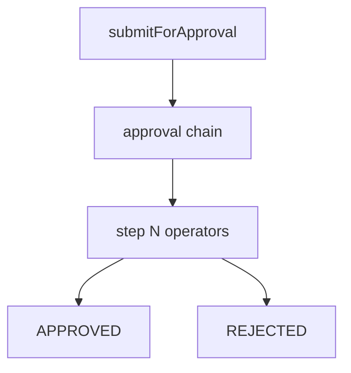

# Approvals engine

## Purpose

Configurable approval chains, queue operations (approve/reject/delegate/clarify), operators registry, and invoice submit-for-approval.

## Flow



## Entry points

| Piece | Path |
|-------|------|
| Engine | `packages/api/src/services/approval-engine.ts` |
| Operators | `services/approval-engine/operators/registry.ts` |
| Queue | `routers/core/approval-queue.ts` |
| Submit | `routers/core/approval-submit.ts` |
| UI | `apps/web-vite/src/components/approvals/` |

## Invariants

- Invoice must be matched before submit — [[invoice-to-payment]]
- APPROVAL_REQUEST notification (`approval-submit.ts` submitForApproval) is enqueued through the outbox INSIDE the submit tx (`enqueueNotificationOutboxEvent`, dedupKey `approval-request:<stepId>`) so it commits atomically with the flow + the invoice `APPROVAL_PENDING` flip — exactly-once. See [[notifications-and-reminders]]
- Teams/Slack cards via integration framework
- `approve` / `reject` each write a same-tx `writeAuditLog` row (`approval.approve` / `approval.reject`) keyed to the flow's `resourceType` / `resourceId` — see [[patterns/audit-log]]
- **The engine is resource-agnostic — reuse it, never fork it.** A new approvable (Phase 92 `LEAVE_REQUEST`) plugs in at exactly two seams: a domain **route** helper (`routeToLeaveChain` in `approval-engine.ts`) + `createApprovalFlow({ resourceType })` at submit, and the **shared** `approve`/`reject`/bulk procedures at finalize. Those procedures are resourceType-gated (`requireAnyPermission({invoice:['approve']},{employee:['approve_leave']})` + a body `resourceType→permission` assertion), so a `leave_approver` actions a `LEAVE_REQUEST` via `employee:approve_leave` and never gains `invoice:approve` (the BFLA fence). Do NOT build a parallel leave approval flow. See [[leave-and-time]]

## Related

- [[workflows-and-roles]]
- [[invoice-to-payment]]
- [[leave-and-time]]
- [[integrations/teams]]

## Verify live

```bash
semble search "approval-engine"
semble search "submitForApproval"
```

## Agent mistakes

- Bypassing operator registry for one-off approval logic
