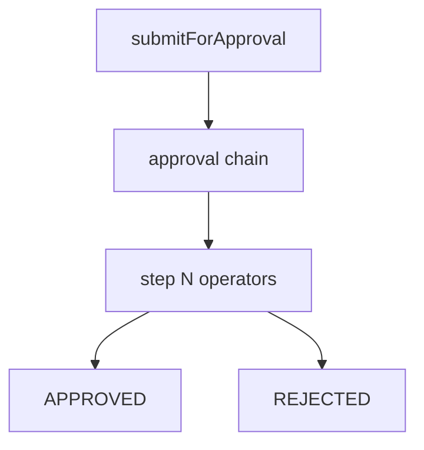

# Approvals engine

## Purpose

Configurable approval chains, queue operations (approve/reject/delegate/clarify), operators registry, and invoice submit-for-approval.

## Flow



## Entry points

| Piece | Path |
|-------|------|
| Engine | `packages/api/src/services/approval-engine.ts` |
| Operators | `services/approval-engine/operators/registry.ts` |
| Queue | `routers/core/approval-queue.ts` |
| Submit | `routers/core/approval-submit.ts` |
| UI | `apps/web-vite/src/components/approvals/` |

## Invariants

- Invoice must be matched before submit — [[invoice-to-payment]]
- Teams/Slack cards via integration framework

## Related

- [[workflows-and-roles]]
- [[invoice-to-payment]]
- [[integrations/teams]]

## Verify live

```bash
semble search "approval-engine"
semble search "submitForApproval"
```

## Agent mistakes

- Bypassing operator registry for one-off approval logic
