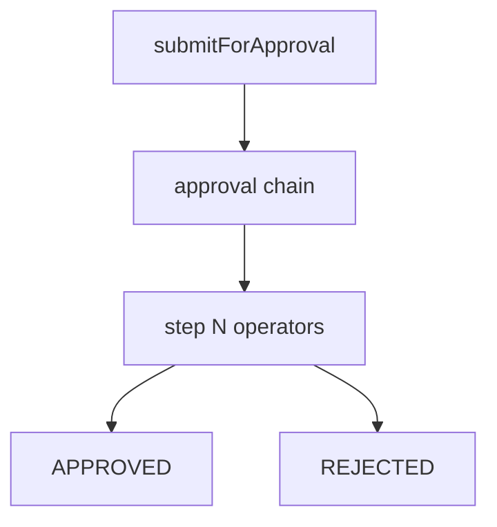

# Approvals engine

## Purpose

Configurable approval chains, queue operations (approve/reject/delegate/clarify), operators registry, and invoice submit-for-approval.

## Flow



## Entry points

| Piece | Path |
|-------|------|
| Engine | `packages/api/src/services/approval-engine.ts` |
| Operators | `services/approval-engine/operators/registry.ts` |
| Queue | `routers/core/approval-queue.ts` |
| Submit | `routers/core/approval-submit.ts` |
| SLA cron | `apps/cron-worker/.../reminders/approval-sla.ts` |
| UI | `apps/web-vite/src/components/approvals/` |

## Invariants

- Invoice must be matched before submit — [[invoice-to-payment]]
- APPROVAL_REQUEST notification (`approval-submit.ts` submitForApproval) is enqueued through the outbox INSIDE the submit tx (`enqueueNotificationOutboxEvent`, dedupKey `approval-request:<stepId>`) so it commits atomically with the flow + the invoice `APPROVAL_PENDING` flip — exactly-once. See [[notifications-and-reminders]]
- Teams/Slack cards via integration framework
- `approve` / `reject` each write a same-tx `writeAuditLog` row (`approval.approve` / `approval.reject`) keyed to the flow's `resourceType` / `resourceId` — see [[patterns/audit-log]]
- **The engine is resource-agnostic — reuse it, never fork it.** A new approvable (Phase 92 `LEAVE_REQUEST`) plugs in at exactly two seams: a domain **route** helper (`routeToLeaveChain` in `approval-engine.ts`) + `createApprovalFlow({ resourceType })` at submit, and the **shared** `approve`/`reject`/bulk procedures at finalize. Those procedures are resourceType-gated (`requireAnyPermission({invoice:['approve']},{employee:['approve_leave']})` + a body `resourceType→permission` assertion), so a `leave_approver` actions a `LEAVE_REQUEST` via `employee:approve_leave` and never gains `invoice:approve` (the BFLA fence). Do NOT build a parallel leave approval flow. See [[leave-and-time]]
- Deciding a step is compare-and-swap, not read-then-write: the state transition uses a guarded `updateMany({ where: { id, status: 'PENDING', approverUserId }, data })` and only proceeds (decision row, flow advancement, finalize) when `count === 1`. A `count === 0` loser throws `CONFLICT` (`approvalStepAlreadyDecided`). This closes the TOCTOU window where two racers (e.g. approve + reject) both read `PENDING` and both act. The `findFirst` + `validateStepForAction` read stays only for early 404/403/permission checks — the CAS is the real gate. `bulkApprove` / `bulkReject` carry the same guard per step (a lost race counts as a failed step in the aggregate result).
- A stalled approval is escalated by cron, not left silent. `computeSlaStatus` only renders "overdue" in the queue UI; the breach action is `detectOverdueApprovals` (`apps/cron-worker/.../reminders/approval-sla.ts`), a reminders sub-job that finds PENDING `ApprovalStep` rows past `slaDeadline`, nudges the assigned approver (`APPROVAL_REQUEST`, entity `APPROVAL_FLOW`/step id, 24h dedup via the Notification table), and after N daily breaches escalates **once** (guarded by `claimCronNotificationDedup`) to the next `NOT_STARTED` chain step's approver. It deliberately does NOT mutate flow state (step status / `currentStepOrder`) — activating steps and advancing the flow stays owned by the engine so the cron never races the approve/reject CAS.

## Related

- [[workflows-and-roles]]
- [[invoice-to-payment]]
- [[leave-and-time]]
- [[notifications-and-reminders]]
- [[integrations/teams]]

## Verify live

```bash
semble search "approval-engine"
semble search "submitForApproval"
```

## Agent mistakes

- Bypassing operator registry for one-off approval logic
- Gating a decision on the `findFirst` read alone (read-then-`update` by `id`) — that is the TOCTOU bug; the transition must be a guarded `updateMany` CAS on `status: 'PENDING'` with a `CONFLICT` on `count === 0`
