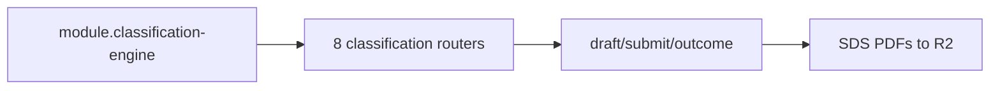

# Classification (IR35 / DRV)

## Purpose

Engagement classification (IR35 UK, Scheinselbständigkeit DE), SDS PDFs, DRV clearance, economic dependency alerts, reassessment triggers — **flag-gated**.

## Flow



## Entry points

| Namespace | Role |
|-----------|------|
| `classification` | assessments draft/autosave/submit |
| `classificationDashboard` | per-market health |
| `classificationDocument` | SDS + DRV bundles + US determination letter |
| `ir35Chain` | chain participants |
| `ir35Attestation` | other-client attestation |
| `economicDependencyAlert` | §2 SGB VI scan |
| `reassessmentTrigger` | material-change triggers; `acknowledge`/`dismiss` run in a tx and write a same-tx `writeAuditLog` row (`reassessment.acknowledge` / `reassessment.dismiss`, `resourceType: CONTRACTOR`) — see [[patterns/audit-log]] |
| `statusfeststellungsverfahren` | DRV § 7a clearance |

Scoring: `packages/classification/`. Cron: [[structure/cron-jobs]].

## UI surface

`apps/web-vite/src/components/contractors/classification/`, `classification/`.

## Invariants

- [[patterns/feature-flags]] — `module.classification-engine`
- `classificationProcedure` middleware defense-in-depth
- When OFF: runtime `METHOD_NOT_FOUND`

## Related

- [[contractors-engagements]]
- [[structure/api-routers-catalog]]

## Verify live

```bash
grep CLASSIFICATION_ENABLED packages/api/src/root.ts
semble search "classificationProcedure"
```

## Agent mistakes

- Assuming classification API exists without flag check
- Citing 55 routers — verify root.ts (53 + 8 conditional)
