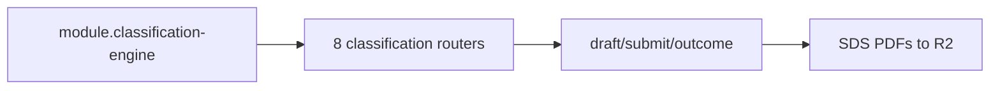

# Classification (IR35 / DRV)

## Purpose

Engagement classification (IR35 UK, Scheinselbständigkeit DE), SDS PDFs, DRV clearance, economic dependency alerts, reassessment triggers — **flag-gated**.

## Flow



## Entry points

| Namespace | Role |
|-----------|------|
| `classification` | assessments draft/autosave/submit |
| `classificationDashboard` | per-market health |
| `classificationDocument` | SDS + DRV bundles + US determination letter |
| `ir35Chain` | chain participants; upsert scopes updates to `contractorAssignmentId`; `reorderParticipants` runs in one `$transaction` |
| `ir35Attestation` | other-client attestation; concurrent first-write `P2002` recovers via re-read + update |
| `economicDependencyAlert` | §2 SGB VI scan |
| `reassessmentTrigger` | material-change triggers; `acknowledge`/`dismiss` use status-guarded `updateMany` inside `$transaction` + same-tx `writeAuditLog` (`reassessment.acknowledge` / `reassessment.dismiss`, `resourceType: CONTRACTOR`) — see [[patterns/audit-log]] |
| `statusfeststellungsverfahren` | DRV § 7a clearance |

Scoring: `packages/classification/`. Cron: [[structure/cron-jobs]].

## UI surface

`apps/web-vite/src/components/contractors/classification/`, `classification/`.

## Invariants

- [[patterns/feature-flags]] — `module.classification-engine`
- `classificationProcedure` middleware defense-in-depth
- When OFF: runtime `METHOD_NOT_FOUND`
- **Answer envelope:** `saveAnswer` Zod schemas normalise wizard payloads to `{ value }` (yes-no/likert/billing-ratio/rationale) or `{ rawScore, isNotApplicable? }` (score-0-3) before persistence; `submit` runs `normalizeAnswerMap` so legacy bare rows still score.
- `recreateComplianceAssessment` bulk failures return generic `complianceRecomputeFailed` (detail logged server-side only)
- The §2 SGB VI economic-dependency scan (`economic-dependency-scan.ts`) writes each assignment's `EconomicDependencyAlertState` upsert and enqueues the band heads-up into the transactional outbox in **one `$transaction`** ([[patterns/transactional-outbox]]) — exactly-once via the drain, closing the crash window where `lastReminderAt` was bumped but the notice dropped.
- The DE economic-dependency daily scan runs a **constant 4 queries per assignment**: one cross-org peer `findMany` + one `invoice.aggregate` — never re-fetch `organization.findMany` per assignment or load the identity twice (that was O(assignments × orgs)).
- The other-client-attestation hook (`apps/web-vite/src/components/contractors/hooks/use-other-client-attestation.ts`) invalidates via `trpc.ir35Attestation.pathFilter()` — string-literal invalidation keys silently no-op and leave stale forms that resubmit into P2002.

## Related

- [[contractors-engagements]]
- [[structure/api-routers-catalog]]

## Verify live

```bash
grep CLASSIFICATION_ENABLED packages/api/src/root.ts
semble search "classificationProcedure"
```

## Agent mistakes

- Assuming classification API exists without flag check
- Citing 55 routers — verify root.ts (53 + 8 conditional)
- Invalidating tRPC queries with string-literal keys — use `trpc.<router>.pathFilter()`; literals no-op silently
