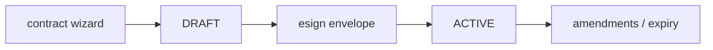

# Contracts lifecycle

## Purpose

Engagement contracts: wizard creation, amendments, status transitions, e-sign (DocuSign/Autenti), health checks, Linear/Jira links.

## Flow



## Entry points

| Piece | Path |
|-------|------|
| Router | `contract` — `packages/api/src/routers/core/contract.ts` |
| E-sign | `esign` router + `services/esign-orchestrator.ts` |
| Health templates | `services/contract-health/` |
| UI | `apps/web-vite/src/components/contracts/` |

## Invariants

- Legal clauses from validators — not ad-hoc UI copy
- Audit on create/update/transition/delete via `auditedMutation` + `auditMutationCtx` — DB write + audit row same `$transaction` (calendar sync remains fire-and-forget after commit)
- `updateExpiryReminders` — audit `contract.expiry_reminders.update` with old/new `reminderDaysBefore`

## Related

- [[contractors-engagements]]
- [[workflows-and-roles]]
- [[integrations/docusign-esign]]

## Verify live

```bash
semble search "esign-orchestrator"
semble search "contractRouter"
```

## Agent mistakes

- Duplicating IP/legal text in components
