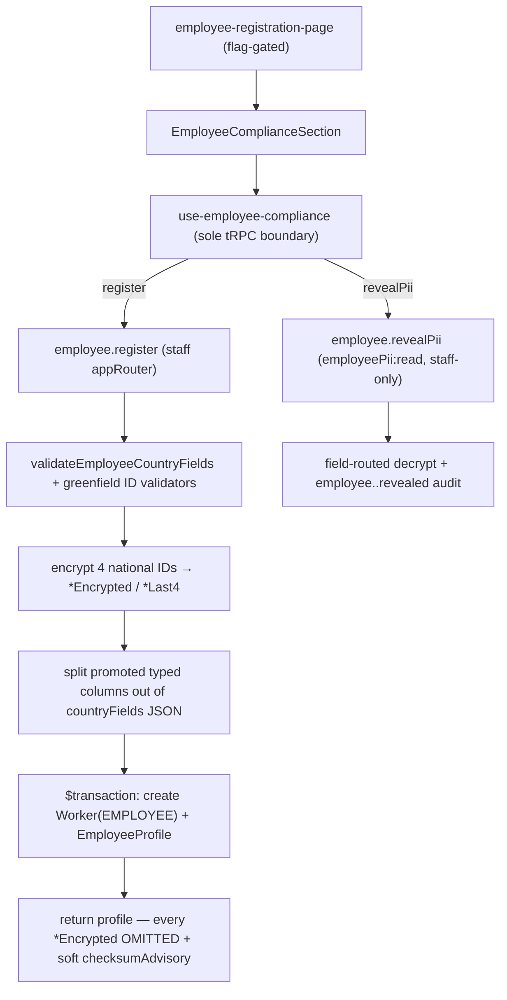

# Employee registry (per-market employee onboarding)

## Purpose

The employee registry is the HR write surface that onboards a full-time employee for one of six markets (PL / DE / UK / US / AE / SA), capturing the statutory field set that market requires and the national identifier that must live encrypted. It is the employee half of the [[worker-foundation]] union: an employee is **not** a separate table — it is a `Worker` row with `workerType='EMPLOYEE'` plus a 1:1 `EmployeeProfile` that carries the tenant-owning HR payload. The registry validates each market's fields against a `.strict()` schema, encrypts the four national IDs into dedicated columns (never into the free-form JSON), and gates the plaintext reveal behind a distinct `employeePii:read` permission with an audit trail. The whole surface stays dark behind `module.workforce-employees`.

## Flow



- **register is a full HR registration, not an attach.** Because an employee is modelled as a `Worker(workerType='EMPLOYEE')` with no standalone `Employee` table, `register` creates the `Worker` identity root **and** its 1:1 `EmployeeProfile` (linked by `workerId String @unique`) in one `$transaction`. It is `.strict()` (mass-assignment of `organizationId`/encrypted columns is rejected), routes through `requirePermission({ employee: ['create'] })`, and writes an `employee.registered` audit row.
- **Per-market validation is a parallel registry, not a fork.** `validateEmployeeCountryFields(cc, fields)` dispatches to `employeeCountryFieldsSchemaMap` (PL/DE/GB/US/AE/SA, each `.strict()`), a sibling of the contractor country-fields map — the contractor exports stay byte-identical. Structurally-invalid national IDs hard-reject with a `BAD_REQUEST` error constant; the eight greenfield statutory validators (PESEL, Steuer-IdNr, NI, UK tax-code, Saudi-ID, Emirates-ID, GOSI, WPS) supply the checks.
- **National IDs encrypt into dedicated columns.** PESEL / Iqama / Emirates-ID encrypt via `encryptPii` on the dedicated `EMPLOYEE_PII_ENCRYPTION_KEY`; the US SSN reuses `encryptSsn` on `SSN_ENCRYPTION_KEY`. Each writes a `*Encrypted` blob + a `*Last4` masked column. **Every `*Encrypted` column is `omit`ted on the register return** — the write path never echoes ciphertext.
- **Emirates-ID checksum is advisory.** Format is blocking, but the Luhn-variant checksum is advisory-only: a format-valid Emirates ID whose checksum fails still registers and surfaces a soft `checksumAdvisory` field — it never throws.
- **revealPii is field-routed, gated, audited, staff-only.** Input `{ workerId, field }`, guarded by `requirePermission({ employeePii: ['read'] })` (403 without), an org-scoped single-column `findUnique`, then a per-field decrypt (`ssn` → `decryptSsn` / SSN key; `pesel`/`iqama`/`emiratesId` → `decryptPii` / EMPLOYEE key) and an `employee.<field>.revealed` audit row. It is mounted only on the staff `appRouter` — never on `portalAppRouter`.
- **Reference lists are seeded, not live.** `listReferenceLists` (`employee:read`) returns the non-PII per-market tuples (NFZ oddziały, Lohnsteuerklasse, student-loan plans, W-4 filing status, US withholding states, Saudization categories) plus the versioned seed tables (ZUS oddziały, urzędy skarbowe, Krankenkassen). `elstam-stub.ts` `lookupElstam` is a typed local-only seam that makes **no network call** — there is no live government API.

## Entry points

| Piece | Path |
|-------|------|
| Registry router | `packages/api/src/routers/employee/employee-registry-router.ts` (`employeeRegistryRouter` — `register` / `revealPii` / `listReferenceLists`) |
| Namespace composition | `packages/api/src/routers/core/employee.ts` (`mergeRouters(employeeBaseRouter, employeeRegistryRouter)` → the `employee.*` namespace on the staff `appRouter` only) |
| Prisma model | `packages/db/prisma/schema/employee.prisma` (`EmployeeProfile` + `enum EmploymentStatus`) |
| PII crypto | `packages/api/src/services/employee-pii-crypto.ts` (`encryptPii`/`decryptPii`/`maskLast4`, `EMPLOYEE_PII_ENCRYPTION_KEY`) |
| Greenfield validators | `packages/validators/src/employee-validators.ts` (8 statutory ID validators; `EmiratesIdResult` advisory type) |
| Country-fields registry | `packages/validators/src/employee-country-fields.ts` (`employeeCountryFieldsSchemaMap` + `validateEmployeeCountryFields`) |
| Reference enums + seeds | `packages/validators/src/employee-reference-lists.ts` + `packages/validators/src/reference-data/{zus-oddzialy,urzedy-skarbowe,krankenkassen}.ts` |
| ELStAM stub seam | `packages/api/src/services/elstam-stub.ts` (`lookupElstam`, no network) |
| Logger PII-mask | `packages/logger/src/pii-mask.ts` (`pesel`/`iqama`/`emiratesId`/`nationalId` paths) |
| RBAC | `packages/auth/src/permissions.ts` (`employee` + `employeePii` resources) + `roles.ts` (`employeePii:read` → owner/admin/hr_admin) |

### Storage shape (`EmployeeProfile`)

Tenant-owning (`organizationId`), 1:1 on `Worker` via `workerId String @unique` (mirrors `Contractor.workerId` — **not** a re-key, and **not** an `employeeId` to a non-existent `Employee` table). Hybrid storage:

- **`countryFields Json?`** — non-PII per-market fields validated by the `.strict()` schema map.
- **Four dedicated encrypted column pairs** — `pesel/ssn/iqama/emiratesId` `*Encrypted` + `*Last4` (AES-256-GCM). National IDs live here only, never in the JSON.
- **Promoted typed columns** — `saudizationCategory NitaqatBand?` (fine 6-value band), `etat Decimal? @db.Decimal(3,2)`, `employmentStatus EmploymentStatus?` (`ACTIVE`/`ON_LEAVE`/`SUSPENDED`/`TERMINATED`) — set from dedicated typed inputs so dashboard filters never parse the loosely-typed JSON.
- `@@unique([organizationId, workerId])`, `@@index([organizationId])`, `@@index([organizationId, employmentStatus])`. **Absent from `globalModels`** so `withTenantScope` injects org scope on every read.

## UI surface

`apps/web-vite/src/components/employees/` — layering is **page → wired section → hook → presentational, with NO `*-container.tsx`**:

- **Page** — `employee-registration-page.tsx` (thin composer, `Suspense` + `AnimateIn`), reached at the `/employees` route; the whole tree is removed when `useFlag('module.workforce-employees')` is off (render-tree removal, no skeleton stub).
- **Wired section** — `compliance/employee-compliance-section.tsx` (`EmployeeComplianceSection`) owns loading/empty/error, the market selector, the save gate, and `EmployeeFieldsDispatch` (PL/DE/UK/US/AE/SA → six presentational field components, `default: return null`).
- **Hook** — `compliance/hooks/use-employee-compliance.ts` is the **sole tRPC boundary** (`listReferenceLists` + `register`); `compliance/hooks/use-reveal-employee-pii.ts` holds the reveal value in local `useState`, never the query cache.
- **Presentational** — `employee-pii-masked-reveal.tsx` (reveal control absent without `employeePii:read`), `reference-list-picker.tsx`, `field-primitives.tsx` (three-class feedback: hard `FieldError` blocks save / amber `AdvisoryPill` never blocks / muted `AdviserVerifyNote`), and `compliance/{pl,de,uk,us,ae,sa}-employee-fields.tsx`.
- **i18n** — keys live in `apps/web-vite/messages/{en,de,pl,ar}.json` under the `Employees` namespace (there is no `src/i18n/locales/` path in this app); RTL uses logical properties only.

## Invariants

- **No `Employee` table** — an employee is a `Worker(workerType='EMPLOYEE')`; `EmployeeProfile` attaches 1:1 via `workerId @unique`, and `revealPii` is keyed by `workerId`.
- **National IDs never in `countryFields` JSON** — the `.strict()` per-market schema rejects any `pesel`/`ssn`/`iqama`/`emiratesId` key; IDs live only in the dedicated encrypted columns.
- **Three non-SSN IDs use `EMPLOYEE_PII_ENCRYPTION_KEY`; SSN reuses `SSN_ENCRYPTION_KEY`** — independent blast radius; both keys are required-in-schema (boot fails loud if unset).
- **Encrypted columns are `omit`ted on the register return** — the write path never returns ciphertext.
- **Emirates-ID checksum is advisory** — format-valid + checksum-failing still registers; a `checksumAdvisory` is surfaced, never an error.
- **Audit rows use `resourceType: 'ORGANIZATION'`** — the `EntityType` enum has no `EMPLOYEE`/`WORKER` member (following the `worker.backfill` precedent); `resourceId = EmployeeProfile.id`, `workerId`/`field` in metadata.
- **`revealPii` is staff-only** — never mounted on `portalAppRouter`.
- **`EmployeeProfile` is tenant-owning** — never in `globalModels`; proven by `employee-cross-org-leak.test.ts` (ORG_B never reads/mutates ORG_A's row through the real `withTenantScope`).

## Live state

Schema, generated Prisma client, RBAC grant, router, and UI all land in the tree. Two follow-ups are deliberately deferred (LOCAL-ONLY posture): the additive `EmployeeProfile` migration is authored but **not applied** to the live EU/ME/US regional databases, and the web-vite RBAC mirror (`use-permissions.ts` / `memberRoles`) does not yet grant `employee`/`employeePii` to the HR roles — so the Register and reveal controls **fail closed (absent)** for current member roles until the HR-role frontend surface is wired.

## Related

- [[worker-foundation]]
- [[structure/prisma-schema-areas]]
- [[structure/packages]]
- [[structure/web-vite-domains]]
- [[structure/api-routers-catalog]]
- [[patterns/rbac-permissions]]
- [[patterns/feature-flags]]
- [[patterns/tenant-and-audit]]

## Verify live

```bash
semble search "employeeRegistryRouter"
grep -n 'model EmployeeProfile' packages/db/prisma/schema/employee.prisma
grep -c revealPii packages/api/src/portal-root.ts   # must be 0 (staff-only)
pnpm --filter @contractor-ops/api exec vitest run employee-registry employee-cross-org-leak
pnpm --filter @contractor-ops/validators exec vitest run employee-validators employee-country-fields
```

## Agent mistakes

- Assuming a standalone `Employee` table — there is none; `EmployeeProfile` FKs `Worker` via `workerId` (not `employeeId`), and an employee is a `Worker(workerType='EMPLOYEE')`.
- Putting a national ID in `countryFields` JSON — the `.strict()` schema rejects it; IDs belong in the dedicated encrypted columns.
- Hard-rejecting a format-valid Emirates ID on its checksum — the checksum is advisory (`checksumAdvisory`), never a throw.
- Calling a live government API for ZUS/NFZ/urzędy/Krankenkassen/ELStAM — these are versioned adviser-verify LOCAL-ONLY seeds + a no-network stub.
- Adding `EmployeeProfile` to `globalModels` (breaks tenant scope — IDOR).
- Mounting `revealPii` on the portal router, or returning `*Encrypted` blobs from `register`.
- Expecting a dedicated `EMPLOYEE`/`WORKER` `EntityType` — audit rows use `resourceType: 'ORGANIZATION'` with `workerId` in metadata.
- Looking for employee i18n under `src/i18n/locales/` — it lives in `messages/{locale}.json` under `Employees`.
