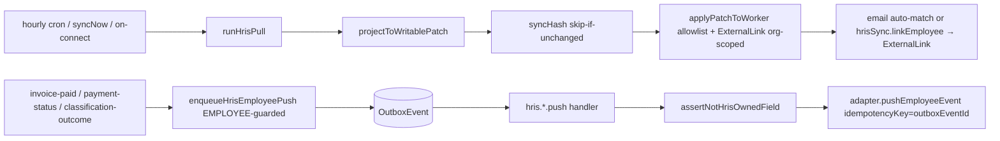

# HRIS two-way sync

## Purpose

Two-way sync between Contractor-Ops and an org's HRIS (Personio OR BambooHR — never both). The **inbound pull** writes HRIS-owned employee registry fields; the **outbound push** carries CO-owned business events (invoice-paid / payment-status / classification-outcome) back to the HRIS. Ships dark behind `module.workforce-employees` + the per-provider `integration.personio-sync` / `integration.bamboohr-sync` flags.

## The field partition (source-of-truth split)

The loop-break is **structural, not heuristic**: the owner sets are DISJOINT, so no field is written by both directions.

| Field | Owner | Direction |
|-------|-------|-----------|
| `Worker.displayName`, `Worker.email` | HRIS | pull writes |
| `EmployeeProfile.employmentStatus`, `etat` | HRIS | pull writes |
| `EmployeeProfile.countryFields` (position/department/mapped custom attrs) | HRIS | pull MERGES (CO keys survive) |
| `PersonnelFile.hireDate`, `terminatedAt` | HRIS | pull writes |
| invoice / payment / classification / compliance | Contractor-Ops | push carries out |
| national IDs (`*Encrypted` / `*Last4`, pesel/ssn/iqama/emiratesId) | Contractor-Ops | NEVER HRIS-writable |

`HrisWritableEmployeePatch` (field-partition.ts) is the type-level allowlist — the protected keys are physically absent, so a pull's Prisma update payload cannot carry them. `projectToWritablePatch` drops any HRIS attribute a mapping points at a protected/unknown target (token denylist on `countryFieldsPatch`).

## Flow

## Loop-break

- **Disjoint partition** — the pull writes only HRIS-owned fields (no push trigger); the push carries only CO-owned events (the pull allowlist can't map them). No cycle exists.
- **`syncHash`** (SHA-256 of the writable projection, key-order-independent) makes the pull idempotent: an unchanged snapshot is a no-op write. **Hash is recorded only when `applyPatchToWorker` returns `applied:true`** — unlinked records are re-attempted after linking.
- **`assertNotHrisOwnedField`** — a change-origin guard on every push that throws if a payload ever carries an HRIS-owned key (defense-in-depth against a future co-owned field re-introducing a loop).
- HRIS-wins for HRIS-owned; CO-wins for CO-owned. No merge, no AI.

## Entry points

| Piece | Path |
|-------|------|
| tRPC | `hrisSync` router (workforce) |
| Pull | `runHrisPull` / `runScheduledHrisSync` (`pull-orchestrator.ts`) |
| Apply | `applyPatchToWorker` (`apply-patch.ts`) |
| Push | 3 `hris.*.push` outbox types + `hris-push.ts` handlers |
| Producers | `payment-run-ops.updateItemStatus` (invoice-paid + payment-status), `classification-submit.submit` (classification-outcome) |
| Adapters | `personio-adapter.ts`, `bamboohr-adapter.ts` |
| Cron | `hris-sync` hourly (`CRON_HRIS_SYNC_SCHEDULE`) |
| UI | `components/hris-sync/*`, `pages/dashboard/settings/integrations-hris.tsx` |

## Token refresh (`packages/integrations/src/services/token-refresh.ts`)

- **Refresh-lock claim happens before the try/finally.** Losing the optimistic `refreshLockedAt` claim returns early, so the `finally` block can no longer clear ANOTHER process's `refreshLockedAt` — the claim, not a read-then-write check, is what prevents two concurrent callers from both hitting the OAuth token endpoint (double-refresh race).
- **Refresh never writes `lastSyncAt` / `lastSuccessAt`.** Those are the hourly-sync throttle fields owned by the pull orchestrator; stamping them from refresh starved sync for short-TTL token providers. Refresh persists only the rotated credentials + expiry.
- **Adapters without a `refreshToken` handler are skipped before claim/markFailed** (e.g. Personio, which uses long-lived credentials) — the refresh cron never flips them to `REAUTH_REQUIRED`.

## Agent mistakes

- **`invoice.paid` is NOT an outbox event type.** Phase 95 added THREE `hris.*.push` types; do not assume one existed.
- **One-HRIS-per-org is a raw-SQL PARTIAL unique index**, not a Prisma `@@unique` (which can't filter). The predicate casts `provider::text IN ('PERSONIO','BAMBOOHR')` to sidestep the Postgres "new enum value in the same transaction" restriction.
- **National-ID fields are never HRIS-writable** — absent from the allowlist type; the `countryFieldsPatch` token denylist drops them even under a hostile mapping.
- The push producers are **EMPLOYEE-guarded** — contractor invoices/payments/assessments never push (in the current model these seams resolve to CONTRACTOR workers, so they are inert forward seams).
