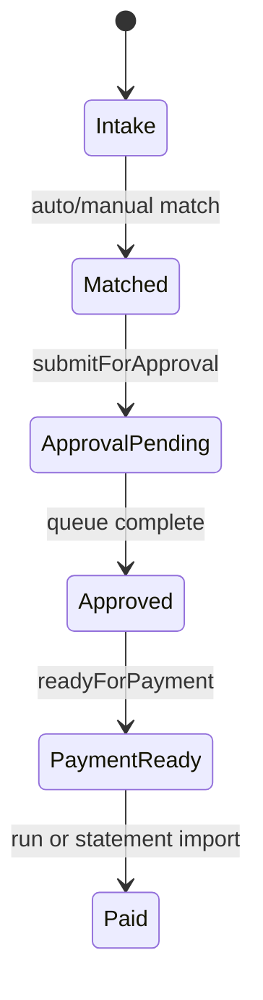

# Invoice to payment flow

> Canonical brownfield: `.planning/codebase/ARCHITECTURE.md`. Symbols → semble.

## Purpose

Core product value: inbound invoice → match → approval → payment run → bank export with full audit trail.

## Flow



## Entry points

| Stage | Router / service | Path |
|-------|------------------|------|
| Intake | `invoiceIntake` | `packages/api/src/services/invoice-intake/` |
| CRUD | `invoice` | `routers/finance/invoice-crud.ts` |
| Match | `invoice` | `services/invoice-matching.ts` |
| Submit | `approval` | `routers/core/approval-submit.ts` |
| Queue | `approval` | `services/approval-engine.ts` |
| Payment run | `payment` | `routers/finance/payment-core.ts` |
| Compliance gate | — | `services/compliance-payment-gate.ts` |
| Export | `payment` | `payment-export-router.ts` |
| German Leitweg-ID | `leitwegId` | `routers/finance/leitweg-id.ts` — public-sector routing |
| FX rates | `exchangeRate` | ECB daily rates for multi-currency display |
| E-invoice status | `einvoice` | country profile compliance column |

## UI surface

`apps/web-vite/src/components/invoices/`, `components/payments/`, `components/approvals/`.

## Invariants

- Match: `MATCHED` or `MANUALLY_CONFIRMED` before approval submit
- `invoice.create` enqueues the finance-team `INVOICE_RECEIVED` notification into the transactional outbox **inside** the create tx (`enqueueNotificationDispatch({ tx })`, dedupKey `INVOICE_RECEIVED:${invoiceId}`) — delivered iff the invoice commits, then exactly-once by the drain (replaces post-commit fire-and-forget). See [[patterns/transactional-outbox]].
- Payment run blocked when compliance fails — `@contractor-ops/compliance-policy`
- INVOICE_RECEIVED notification (`invoice-crud.ts` create) is enqueued through the outbox INSIDE the create tx (`enqueueNotificationOutboxEvent`, dedupKey `invoice-received:<id>`), not post-commit fire-and-forget — exactly-once. See [[notifications-and-reminders]]
- [[patterns/tenant-and-audit]] on mutations
- Intake upload (`invoice-intake/ingest.ts`): base64 string length is capped before `Buffer.from` decode (`ceil(INTAKE_MAX_FILE_BYTES / 3) * 4` chars) so an oversized payload is never materialized; the post-decode `INTAKE_MAX_FILE_BYTES` (5 MiB) check stays as a backstop. Both throw `FILE_TOO_LARGE`.

## Related

- [[payments-and-bank-files]]
- [[approvals-engine]]
- [[compliance-dashboard]]
- [[portal-external]]
- [[integrations/ksef]]

## Verify live

```bash
semble search "compliance-payment-gate"
semble search "submitForApproval"
```

## Agent mistakes

- Skipping match gate before approval
- Missing writeAuditLog on payment export (tech debt — fix when touching)
