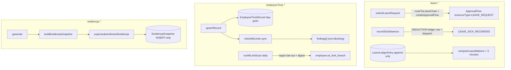

# Leave & KP-grade employee time

## Purpose

The employee-side (workerType=EMPLOYEE) leave and statutory working-time surface, sitting on the [[worker-foundation]] abstraction and gated behind `module.workforce-employees`. It carries three engines: an **append-only leave ledger + balance**, a **day-grain statutory time record** with a synchronous per-jurisdiction working-time check, and a **DB-immutable ewidencja czasu pracy** register (PL KP art. 149). Leave requests reuse the generic [[approvals-engine]] chain rather than a parallel approval system; sick absence is a direct notification, never an approval.

## Flow



- **Leave balance is a fold over an append-only ledger.** `LeaveLedgerEntry` is registered in `APPEND_ONLY_MODELS` (`packages/db/src/tenant.ts`) — rows are written once; corrections are **reversing `ADJUSTMENT` rows**, never edits. `computeLeaveBalance(rows)` (`leave-balance.ts`) sums `minutes`; `recomputeBalanceCache` refreshes the `LeaveBalance` cache row per (worker, leaveType, year). A missing `etat`/entitlement never throws (defaults apply).
- **Leave requests ride the generic approval chain at two seams.** `submitLeaveRequest` calls `routeToLeaveChain` + `createApprovalFlow` (`approval-engine.ts`) with `resourceType='LEAVE_REQUEST'`; approve/reject is NOT re-implemented — it is the shared, resourceType-gated approval procedure, so a `leave_approver`/`hr_admin` actions a leave request via `employee:approve_leave` and never gains `invoice:approve` (the BFLA fence). See [[approvals-engine]].
- **Sick is direct.** `recordSickAbsence` writes a negative `DEDUCTION` ledger row against the org's `SICK` leave type and dispatches `LEAVE_SICK_RECORDED` to the approver roles — zero `ApprovalFlow` rows. Blackout overlap + insufficient-balance are rejected at submit; `listTeamCalendar` buckets PENDING/APPROVED requests per team and flags a day in conflict when ≥2 overlap.
- **Employee time is a distinct day-grain model.** `EmployeeTimeRecord` (one row per worker per `workDate`, upserted) is the statutory model keyed on `workerId` — **separate** from the contractor-coupled `TimeEntry` (see [[time-and-reconciliation]]). `upsertRecord` returns `{ record, findings }`: the sync `checkWtLimits` (pure, per-jurisdiction, `compliance-policy`) flags daily-ceiling / current-week breaches as a **non-blocking advisory payload** carrying dotted i18n copy-keys — it never throws, so a legitimate save is never blocked.
- **The true rolling breach is the daily scan.** `runWtLimitScan` (`wt-limit-scan.ts`, executed inside the reminders cron) fans out over regions, computes per-worker rolling weekly averages, and dispatches ONE `employee.wt_limit_breach` digest per recipient/day, deduped by a **region-prefixed** key. See [[structure/cron-jobs]].
- **Ewidencja is INSERT-only and DB-immutable.** `generate` freezes the KP §149 field set via `buildEwidencjaSnapshot` + `supersedeAndInsertEwidencja` (`ewidencja-builder.ts`): regenerating INSERTs a superseding version (`version+1` + `previousSnapshotId`), never updating a prior row. A `BEFORE UPDATE` trigger `app.reject_ewidencja_update` (migration `20260701000000_ewidencja_append_only`) rejects any UPDATE at the DB. The current register for a period is the highest-`version` row; no `status` flip is written.

## Entry points

| Piece | Path |
|-------|------|
| Leave models | `packages/db/prisma/schema/leave.prisma` (LeaveType, BlackoutPeriod, LeaveRequest, LeaveLedgerEntry, LeaveBalance + LeaveKind/LeaveRequestStatus/LeaveLedgerType) |
| Employee-time model | `packages/db/prisma/schema/employee-time.prisma` (EmployeeTimeRecord + EmployeeTimeSource/AbsenceKind) |
| Ewidencja model | `packages/db/prisma/schema/ewidencja.prisma` (EwidencjaSnapshot + EwidencjaStatus) |
| Public holidays | `packages/db/prisma/schema/reference.prisma` (PublicHoliday, seeded reference) |
| Append-only guard | `packages/db/src/tenant.ts` (`APPEND_ONLY_MODELS` ⊇ `LeaveLedgerEntry`) |
| Immutability trigger | `prisma/schema/migrations/20260701000000_ewidencja_append_only/` (`app.reject_ewidencja_update`) |
| `leave` router | `packages/api/src/routers/workforce/leave.ts` (submitLeaveRequest, recordSickAbsence, getBalance, listRequests, listTeamCalendar, leaveType.*, blackout.*) |
| `employeeTime` router | `packages/api/src/routers/workforce/employee-time.ts` (upsertRecord, listRecords, weekSummary) |
| `ewidencja` router | `packages/api/src/routers/workforce/ewidencja.ts` (generate, list, get) |
| Balance engine | `packages/api/src/services/leave-balance.ts` (computeLeaveBalance, recomputeBalanceCache) |
| WT sync check | `packages/api/src/services/wt-limit-check.ts` (checkWtLimits) |
| WT daily scan | `packages/api/src/services/wt-limit-scan.ts` (runWtLimitScan) |
| Ewidencja builder | `packages/api/src/services/ewidencja-builder.ts` (buildEwidencjaSnapshot, supersedeAndInsertEwidencja) |

## UI surface

Staff/manager surfaces in `apps/web-vite`, each a thin flag-gated page + wired section + `hooks/use-*.ts` sole tRPC boundary (see [[structure/web-vite-domains]]):

- **`/leave`** — leave register + balance-after side-panel (the balance figure is the anchor) + `Record sick leave` dialog. `components/leave/leave-queue-section.tsx` + `hooks/use-leave-queue.ts`. Approve/reject of pending leave happens in the existing `/approvals` inbox (generic `LEAVE_REQUEST` steps).
- **`/leave/calendar`** — month/quarter team capacity + conflict heatmap built from local primitives + a div grid (44px cells, RTL-mirrored, keyboard nav). `components/leave/team-calendar/*` + `hooks/use-team-calendar.ts`. Capacity is a three-tier signal (nobody out / someone out / conflict) — the payload reports out-count + conflict, not headcount.
- **`/employee-time`** — day-grain entry form + three KPI cards + on-save non-blocking WT-limit banner (`wt-limit-warning-banner.tsx` → shared `wt-limit-alert-banner.tsx`). `hooks/use-employee-time.ts`. Notification deep-links: `EMPLOYEE_TIME_RECORD → /employee-time`, `LEAVE_REQUEST → /leave` in `notification-item.tsx` `getEntityUrl`.
- **`/employee-time/ewidencja`** — KP §149 register over `DataTable` with the `ImmutableBadge` (Archived + Lock) anchor + expandable superseded version chain + AlertDialog regenerate confirm. `hooks/use-ewidencja.ts`.

## Invariants

- **Leave balance = Σ append-only `LeaveLedgerEntry.minutes`**; corrections are reversing `ADJUSTMENT` rows, never row edits (`LeaveLedgerEntry` ∈ `APPEND_ONLY_MODELS`). Balance compute never throws on a missing entitlement.
- **`EmployeeTimeRecord` is the employee statutory time model on `workerId`** — DISTINCT from the contractor-coupled `TimeEntry`; the web-vite hook must call `employeeTime.*`, never `time.*` (`check:web-vite-data-layer` + distinct namespaces enforce the boundary).
- **`EwidencjaSnapshot` is INSERT-only + DB-trigger-immutable** (`app.reject_ewidencja_update`): supersession is a new version row (`version+1` + `previousSnapshotId`); the old row stays archived — never deleted (a 10yr KP §94⁴ retention floor is satisfied by non-deletion; the 3yr immutability floor by the trigger).
- **`LEAVE_REQUEST` extends the generic approval chain at exactly two seams** (route → `routeToLeaveChain`, finalize → shared approve/reject); no leave-specific approval fork. The resourceType→permission gate keeps `leave_approver` off `invoice:approve`.
- **The WT-limit daily scan fans out over regions with region-prefixed dedup keys** — one digest per recipient/day per region.
- **On-save WT breach is a warning, not a gate** — `upsertRecord` commits and returns `findings`; it never throws on breach.
- **Statutory leave-accrual + working-time rules are per-market registries in `compliance-policy`** (`leave-registry.ts` / `wt-registry.ts`, registered on import from `policies/<cc>.ts`). Registered markets: **PL, DE, UK, UAE, KSA** (ANNUAL leave + a working-time limit each). **US is intentionally unregistered** — federal law has no statutory paid-leave floor and the FLSA sets no maximum-hours cap (overtime-premium only), so `resolveLeaveAccrual('US','ANNUAL')` / `resolveWtLimits('US')` return `undefined` and the caller falls back to org policy (documented in `policies/us.ts`; do not add a fabricated rule). All registered rule values carry a cited statute + `PENDING legal review` adviser-verify annotation.

## Related

- [[worker-foundation]]
- [[employee-registry]]
- [[approvals-engine]]
- [[time-and-reconciliation]]
- [[notifications-and-reminders]]
- [[structure/prisma-schema-areas]]
- [[structure/api-routers-catalog]]
- [[structure/key-services]]
- [[structure/cron-jobs]]
- [[structure/web-vite-domains]]
- [[patterns/feature-flags]]
- [[patterns/rbac-permissions]]

## Verify live

```bash
semble search "computeLeaveBalance"
grep -nE '^(model|enum) ' packages/db/prisma/schema/{leave,employee-time,ewidencja}.prisma
grep -n 'reject_ewidencja_update' packages/db/prisma/schema/migrations/20260701000000_ewidencja_append_only/migration.sql
pnpm --filter @contractor-ops/api exec vitest run leave-balance leave-approval employee-time-record ewidencja-builder wt-limit-scan
pnpm --filter @contractor-ops/web-vite test team-calendar
```

## Agent mistakes

- Editing a `LeaveLedgerEntry` row to correct a balance (append-only — write a reversing `ADJUSTMENT`)
- Reusing the contractor `time.*`/`TimeEntry` for employee statutory time (use `employeeTime.*` / `EmployeeTimeRecord`)
- Forking a leave-specific approval flow instead of the generic `LEAVE_REQUEST` chain (loses the BFLA fence)
- Treating a WT-limit finding as a hard block (it is a non-blocking advisory; `upsertRecord` never throws)
- Offering an edit/delete on an ewidencja snapshot (DB-trigger immutable; regenerate = new superseding version)
- Deriving calendar capacity as a precise percentage (the payload has out-count + conflict, not headcount — three-tier only)
