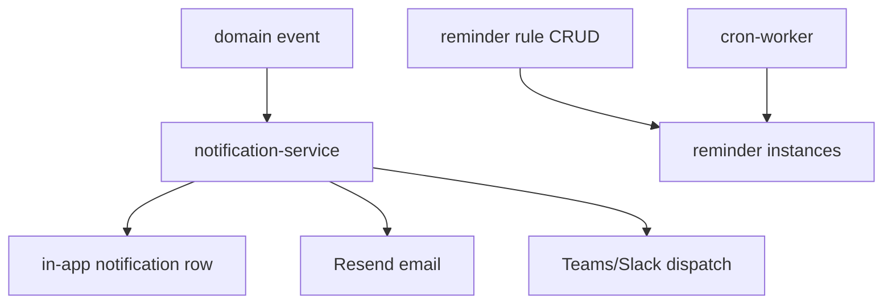

# Notifications and reminders

## Purpose

In-app notifications (unread counts, preferences), outbound email/Slack/Teams delivery, and configurable reminder rules that spawn reminder instances (compliance renewals, DRV expiry, etc.).

## Flow



## Entry points

| Piece | Path |
|-------|------|
| Notification router | `packages/api/src/routers/core/notification.ts` |
| Reminder router | `packages/api/src/routers/core/reminder.ts` |
| Dispatch service | `packages/api/src/services/notification-service.ts` |
| Compliance reminders | `apps/cron-worker/.../compliance-reminder.ts` |
| DRV reminders | `cron-worker/.../reminders/drv-clearance-expiries.ts` |
| UI | `apps/web-vite/src/components/notifications/` |
| Settings prefs | `settings/notification-preferences.tsx` (wired + `NotificationPreferencesView`) |

## Invariants

- Preferences CRUD scoped to tenant user
- Silent catch in dispatch is tech debt — [[decisions/tech-debt-hotspots]]
- Teams/Slack channels via [[integrations/teams]] framework

## Related

- [[approvals-engine]]
- [[compliance-dashboard]]
- [[classification-ir35]]
- [[settings-and-org-admin]]
- [[patterns/logging-and-errors]]

## Verify live

```bash
semble search "notification-service"
semble search "reminderRouter"
```

## Agent mistakes

- Adding notification side effects with empty catch
- Reminder instances without cascade delete on rule toggle-off
