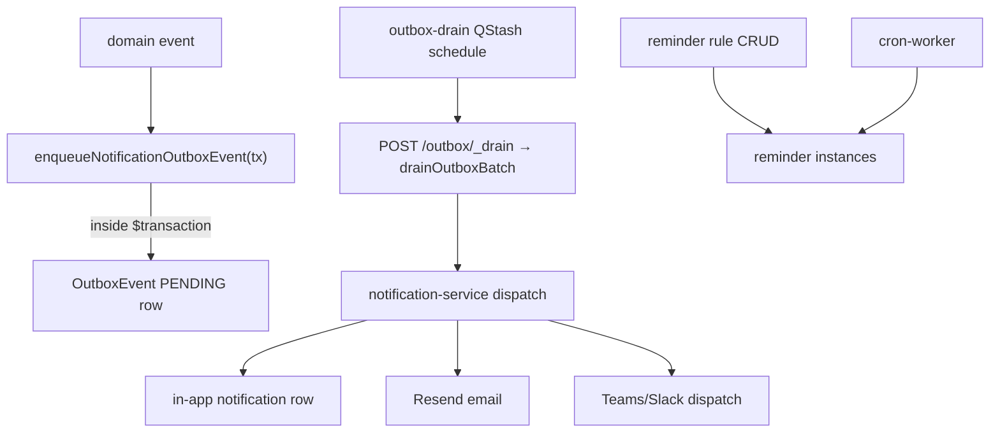

# Notifications and reminders

## Purpose

In-app notifications (unread counts, preferences), outbound email/Slack/Teams delivery, and configurable reminder rules that spawn reminder instances (compliance renewals, DRV expiry, etc.).

## Flow



## Delivery guarantee — transactional outbox (preferred)

Producers should schedule notifications through the outbox instead of a
post-commit `dispatch(...).catch(...)` (which is at-most-once — a crash
between commit and dispatch silently drops the notification):

```ts
await ctx.db.$transaction(async tx => {
  // ...the state change the notification announces...
  await enqueueNotificationOutboxEvent({
    tx,
    event: { organizationId, type, recipientUserIds, title, body, entityType, entityId, metadata },
    dedupKey: `approval-request:${flowId}`, // stable natural key of the state change
  });
});
```

The row commits iff the transaction commits. The boot-ensured `outbox-drain`
schedule polls `POST /outbox/_drain` → `drainOutboxBatch` (claim `FOR UPDATE
SKIP LOCKED` → dispatch → finalize, 5 attempts + backoff, Sentry on exhaust).
The handler threads `OutboxEvent.id` into `dispatch(event, { outboxEventId })`,
so `Notification.(organizationId, dedupKey)` (= `<outboxEventId>:<userId>`) and
the Resend `Idempotency-Key` collapse a redrive to a single delivery →
**exactly-once**. Outbox service: `services/outbox/` ([[structure/key-services]]).

## Entry points

| Piece | Path |
|-------|------|
| Notification router | `packages/api/src/routers/core/notification.ts` |
| Reminder router | `packages/api/src/routers/core/reminder.ts` |
| Dispatch service | `packages/api/src/services/notification-service.ts` |
| Outbox service + helper | `packages/api/src/services/outbox/` (`enqueueNotificationOutboxEvent`, `drainOutboxBatch`) |
| Drain route + schedule | `apps/api/src/routes/outbox.ts` + `apps/api/src/lib/outbox-schedule.ts` |
| Reminder-rule cron | `cron-worker/.../reminders/index.ts` |
| Compliance reminders | `apps/cron-worker/.../compliance-reminder.ts` |
| DRV reminders | `cron-worker/.../reminders/drv-clearance-expiries.ts` |
| UI | `apps/web-vite/src/components/notifications/` |
| Settings prefs | `settings/notification-preferences.tsx` (wired + `NotificationPreferencesView`) |

## Invariants

- Preferences CRUD scoped to tenant user
- New notification sites: enqueue through the outbox inside the announcing `$transaction`, not post-commit `dispatch().catch()` (at-most-once). Direct `dispatch()` is tolerated only where no enclosing tx owns the state change — [[decisions/tech-debt-hotspots]]
- Teams/Slack channels via [[integrations/teams]] framework
- Outbox is single-event-type (`notification.dispatch`) today; add a type in `services/outbox/handlers.ts` before outboxing a non-notification side effect
- **A `ReminderInstance` is skipped only when `SENT`, never merely because it exists.** The reminder cron (`reminders/index.ts`) re-dispatches any row still `PENDING` (a prior tick's `dispatch` threw) rather than treating "row present" as done — otherwise the `(reminderRuleId, entityType, entityId, scheduledFor)` unique would strand the reminder forever. Per-rule try/catch isolates a poison rule/org from the rest of the run.

## Related

- [[approvals-engine]]
- [[compliance-dashboard]]
- [[classification-ir35]]
- [[settings-and-org-admin]]
- [[patterns/logging-and-errors]]

## Verify live

```bash
semble search "notification-service"
semble search "reminderRouter"
```

## Agent mistakes

- Adding notification side effects with empty catch post-commit (at-most-once) — enqueue through the outbox inside the tx instead
- Enqueuing the outbox row OUTSIDE the `$transaction` (defeats atomicity — the row must commit with the state change)
- Reminder instances without cascade delete on rule toggle-off
- Treating a present `ReminderInstance` row as "already sent" (skip only on `status='SENT'`)
