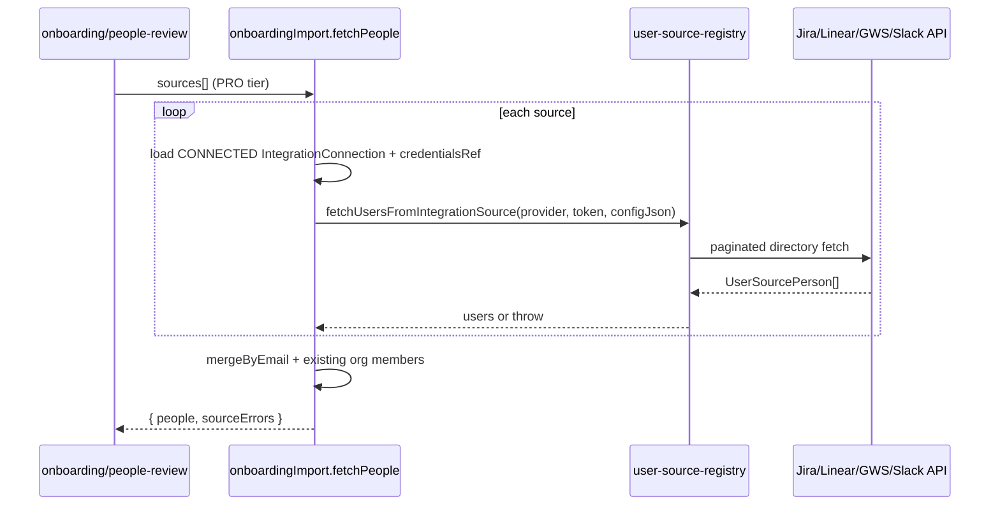

# Onboarding and import

## Purpose

Cross-tool import wizard (source discovery, user merge, project import), CSV/XLSX contractor/contract import, onboarding people flow. Plus the **first-run organization-creation wizard** shown when a signed-in user has no organization yet.

## Flow — cross-tool people import



## Entry points

| Piece | Path |
|-------|------|
| Cross-tool router | `packages/api/src/routers/core/onboarding-import.ts` |
| Merge + templates | `packages/api/src/services/onboarding-import-service.ts` |
| Directory fetch | `packages/integrations/src/services/user-source-registry.ts` |
| Zod schemas (responses) | `packages/validators/src/onboarding-import.ts` |
| CSV import | `import` router |
| Wizard route | `apps/web-vite/src/pages/dashboard/onboarding-import.tsx` (`OnboardingImportPageContent`) |
| Wizard steps/hooks | `apps/web-vite/src/components/onboarding/` |
| UI CSV | `apps/web-vite/src/components/import/` |

## API — `onboardingImport`

| Procedure | Input | Output | `.output()` |
|-----------|-------|--------|-------------|
| `listSources` | — | `ListSourcesOutput` (4 providers: `connected` + `selected`) | `listSourcesOutputSchema` |
| `fetchPeople` | `fetchPeopleInputSchema` (sources min 1) | `{ people, sourceErrors }` | `fetchPeopleOutputSchema` |
| `fetchProjects` | `fetchProjectsInputSchema` (sources min 1; only `JIRA` / `LINEAR` fetched) | `{ projects, sourceErrors }` | `fetchProjectsOutputSchema` |
| `startImport` | `startImportInputSchema` | `{ jobId }` | — |
| `getProgress` | `{ jobId }` | `ImportJob` (`jobId`, `status`, `totalItems`, `completedItems`, `failedItems`) | `importProgressOutputSchema` |
| `retryFailedItem` | `retryItemInputSchema` (`jobId`, `itemKey` email or `project:…`) | `{ success: true }` or `{ success: false, error }` | `retryItemOutputSchema` — People only; `project:` keys return `BAD_REQUEST` |

**Import job state:** `Organization.settingsJson.importJobs` + monotonic `importJobsRevision`; `patchImportJobsSettings` read-modify-write in `$transaction`. `retryFailedItem` passes `expectedRevision` — conflict → `IMPORT_JOB_STATE_CONFLICT`.

**Per-source errors** (partial success allowed):

| `code` | When |
|--------|------|
| `not_connected` | No `CONNECTED` row or missing `credentialsRef` |
| `fetch_failed` | Registry throw, upstream API, pagination cap, invalid config (e.g. Jira missing `cloudId`) |

Successful sources merge into `people` / `projects`; failed sources appear in `sourceErrors` only — not silent empty merge.

**Jira projects:** connected but missing `configJson.cloudId` → `fetch_failed` (not silent `[]`).

## Registry — user sources

| Provider | Pagination | Notes |
|----------|------------|-------|
| LINEAR | GraphQL `users(first:100, after: $cursor)` | Skip inactive; invalid emails skipped via `z.email().safeParse` |
| JIRA | `startAt` / `maxResults=1000` | `configJson.cloudId`; invalid `emailAddress` skipped via `z.email().safeParse` |
| GOOGLE_WORKSPACE | Admin Directory `pageToken`, 500/page | Skip `suspended` / `archived`; invalid `primaryEmail` skipped via `z.email().safeParse` |
| SLACK | `users.list` cursor, 1000/page | Skip bots, deleted, app users, `USLACKBOT`; invalid emails skipped via `z.email().safeParse`; API `ok=false` → throw (per-page failure) |

**Invariants:** `MAX_USER_SOURCE_PAGES = 100` per provider; external JSON via `user-source-schemas.ts`; throws on failure (router catches → `fetch_failed`).

## UI surface — wizard steps

| Step | Component | Hook | Continue gate |
|------|-----------|------|---------------|
| 1 | `source-selection-step.tsx` (`SourceSelectionStepContainer`) | `use-onboarding-source-selection` | ≥1 source selected |
| 2 | `people-review-step.tsx` (`PeopleReviewStepContainer`) | `use-onboarding-people` | `canContinueStep` — see below |
| 3 | `project-import-step.tsx` (`ProjectImportStepContainer`) | `use-onboarding-projects` | `canContinueStep` — see below |
| 4 | `confirm-import-step.tsx` (`ConfirmImportStep` wired; `ConfirmImportStepView` presentational) | `use-onboarding-confirm` / `use-onboarding-progress` | starts import → `{ jobId }`; when `jobId` set, same step shows `ImportProgressTracker` (polls `getProgress`, `retryFailedItem`) with loading/error/empty branches |

**`canContinueStep` gates** (`derivePeopleReviewQueryState` / `deriveProjectImportQueryState`):

| Step | `canContinueStep` when |
|------|------------------------|
| 2 (people) | query ready (`!isLoading && !isFetching && !isError`) and **not** `allSourcesFailed` |
| 3 (projects) | query ready and (`pmSourcesCount === 0` **or** not `allSourcesFailed`) |

People step also requires no unresolved conflicts before the page `computeCanContinue` allows advance.

**`allSourcesFailed` semantics** (people step 2 / projects step 3):

- People: `sourceErrorsCount === selectedSourcesCount` (and `selectedSourcesCount > 0`)
- Projects: `sourceErrorsCount === pmSourcesCount` (and `pmSourcesCount > 0`)
- **Not** `peopleCount === 0 && errors > 0` — partial failure with zero users from one source is partial success, not all-failed

**Refetch:** `useLayoutEffect` syncs query → parent state; **preserves** role/skip/conflict selections on refetch; **resets** only when source set changes (`handleSourcesChange` in `OnboardingImportPageContent`).

**Conflict names:** `startImport` sends `sel.resolvedConflicts.name ?? person.name`.

**Partial error alerts:**

| Step | Condition | Component | i18n namespace |
|------|-----------|-----------|----------------|
| 2 | partial source failure | `PeopleReviewPartialSourceErrors` | `OnboardingImport.step2` |
| 2 | all sources failed | `PeopleReviewSourceErrors` (refetch) | `OnboardingImport.step2` |
| 3 | partial source failure | `PeopleReviewPartialSourceErrors` (`copyNamespace="OnboardingImport.step3"`) | `OnboardingImport.step3` |
| 3 | all sources failed | `PeopleReviewSourceErrors` (refetch) | `OnboardingImport.step3` |

**Orchestrator:** `pages/dashboard/onboarding-import.tsx` (`OnboardingImportPageContent`) — `computeCanContinue` reads `onStepReadinessChange` from step 2/3 hooks.

## First-run organization onboarding (create org)

**Purpose:** a signed-in user with **no active organization and no membership to fall back to** (brand-new account) gets a full-screen "create your organization" wizard instead of the dashboard's `tenantNoActiveOrganization` error.

**Gate** — `apps/web-vite/src/components/layout/dashboard-shell.tsx` (`DashboardShellContainer`) reads the client session synchronously (no tRPC). When `!session.isPending && user && !activeOrganizationId`:

- `auth.useListOrganizations()` empty → render `OrganizationOnboardingContainer`.
- org list pending, or memberships exist (→ `useAutoActiveOrg` activates the first + reloads) → `DashboardShellSkeleton`.

Gating here means the org-dependent shell + tenant procedures (`organization.getCurrent`, `dashboard.bootstrap`) never mount, so `tenantNoActiveOrganization` ([[patterns/tenant-and-audit]]) is never thrown.

**Flow:**

1. Step 1 — org name + billing country. Submit → `auth.organization.create({ name, slug, billingCountry })` → `auth.organization.setActive({ organizationId })` (Better Auth client; **no** tRPC procedure — see [[settings-and-org-admin]]).
2. `billingCountry` (ISO 3166-1 alpha-2) → data region server-side via `resolveDataRegionFromBilling` (`US` → US, else EU; never ME). Country names localized at render via `Intl.DisplayNames`.
3. Step 2 — success + "coming soon" next-action placeholders (invite / import / billing). "Go to dashboard" → `window.location.reload()` so the re-seeded session carries `activeOrganizationId`.

**Entry points:**

| Piece | Path |
|-------|------|
| Shell gate | `apps/web-vite/src/components/layout/dashboard-shell.tsx` (`DashboardShellContainer`) |
| Wizard (wired + views) | `apps/web-vite/src/components/onboarding/organization-onboarding.tsx` (`OrganizationOnboardingContainer`) |
| Hook (auth boundary + RHF/Zod) | `apps/web-vite/src/components/onboarding/hooks/use-organization-onboarding.ts` |
| i18n | `OrganizationOnboarding` namespace (en/de/pl/ar; en-US falls back to en) |

**Agent mistakes:**

- Adding a tRPC `organization.create` procedure — the SPA calls Better Auth `authClient.organization.{create,setActive}` directly (the tRPC `create`/`update` were removed).
- Forgetting `setActive` after create, or skipping the reload — the client session keeps `activeOrganizationId=null` and the dashboard still throws.
- Rendering the wizard inside the org shell — it must **replace** the shell so tenant procedures never run.
- Hardcoding country names — localize via `Intl.DisplayNames`; only `billingCountry: 'US'` routes to the US region.

## Related

- [[integrations/google-workspace]]
- [[integrations/slack]]
- [[patterns/registry-plugin]]
- [[contractors-engagements]]
- [[settings-and-org-admin]]

## Verify live

```bash
semble search "onboardingImport.fetchPeople"
semble search "fetchUsersFromIntegrationSource"
pnpm vitest run apps/web-vite/src/components/onboarding/hooks/__tests__/onboarding-query-state.test.ts
pnpm vitest run packages/api/src/services/__tests__/onboarding-import-service.test.ts
```

## Agent mistakes

- Skipping duplicate detection on bulk import (`mergeByEmail` is authoritative for wizard) — dedup, existing-member match, and the emitted `canonicalEmail` are all lowercase-normalized (output email is the lowercased key, not first-seen casing)
- Treating `fetchPeople` / `fetchProjects` return as flat arrays — must read `.people` / `.projects`
- Adding provider fetch logic in router — register in `user-source-registry.ts`
- Silent swallow of per-source failures — always populate `sourceErrors`
- Using `mergedPeople.length === 0` for `allSourcesFailed` — compare error count to selected source count
- Enabling Continue on step 2/3 when `allSourcesFailed` — gate via hook `canContinueStep`
