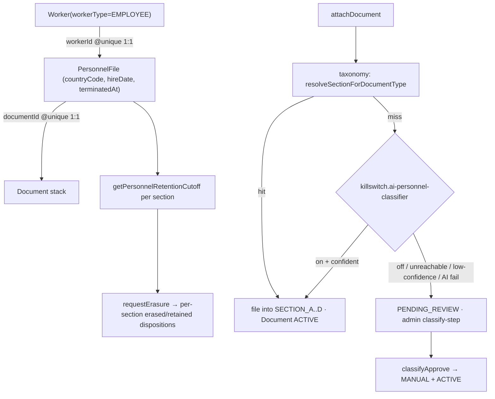

# Personnel file (akta osobowe / Personalakte)

## Purpose

Each employee carries a **jurisdiction-correct personnel file** attached to the
Phase-89/90 `Worker`/`EmployeeProfile` identity — PL *akta osobowe* (cz. A/B/C/D per
KP art. 94), DE *Personalakte*, UK personnel file, US I-9 + file equivalents. The
file delivers four locked capabilities: a **4-section structure with per-section
RBAC**, a **per-jurisdiction retention clock**, **RODO/GDPR erasure that honours
statutory holds**, and **document upload auto-classification** to a section. The
design **composes existing primitives** — it registers on the shared retention map,
extends the GDPR statutory-hold mechanism, reuses the `Document` stack + `PENDING_REVIEW`
admin flow, and clones the AI kill-switch idiom — with three genuinely new builds:
the per-section RBAC grain, per-employee/per-section statutory-hold erasure, and the
document→section classifier.

The whole surface is dark behind `module.workforce-employees` and is **staff-side only**
(the employee self-service akta view is a later phase).

## Flow



- **The file is a sidecar on the worker identity.** `PersonnelFile` (`personnel.prisma`)
  is a 1:1 tenant-owning sidecar FK'd to `Worker.id` via `workerId String @unique`
  (`@@unique([organizationId, workerId])`), not a relation on `EmployeeProfile` — it
  keys off the identity root the retention clock and RBAC anchor on. `countryCode` is
  snapshotted at creation so retention/section rules resolve without a join.
- **4 sections realised as an enum on the document link.** `PersonnelFileDocument`
  references the existing `Document` stack 1:1 (`documentId @unique`, never a fork) and
  carries an optional `section PersonnelFileSection?` (`SECTION_A..D`) — the 4-section
  view is an enum-on-link, not a row-per-section table. `PersonnelDocClassificationMethod`
  (`DETERMINISTIC/AI/MANUAL/PENDING`) records how each document reached its section.
- **Retention clock reads two seams.** `hireDate DateTime? @db.Date` is the hire anchor;
  `terminatedAt DateTime?` is the termination anchor (**null → active → retain
  indefinitely**). **`employee.register` creates the file** (`countryCode` snapshot +
  `hireDate`); `recordTermination` mirrors `terminatedAt` on both `EmployeeProfile` and
  `PersonnelFile` in one tx; HRIS pull upserts `PersonnelFile` and mirrors termination to
  `EmployeeProfile`.
- **Upload → taxonomy → AI(kill-switch) → admin.** `attachDocument` links a persisted,
  virus-scanned `Document`, then runs the hybrid classifier: deterministic taxonomy first
  (no model call), a `killswitch.ai-personnel-classifier`-gated Claude-Vision fallback on
  a miss, and a below-threshold / kill-switch-off / unmapped-jurisdiction result routes to
  the `PENDING_REVIEW` admin classify-step. **The upload is never blocked** — the bytes are
  already persisted; any classifier failure degrades to the admin queue.
- **Erasure honours per-section holds.** `requestErasure({ workerId })` resolves each
  section against its per-jurisdiction window, erases past-window sections (soft-deleting
  their documents), retains in-window sections with a statutory citation + `retainUntil`,
  and **never claims full erasure while any hold is active**.

## Entry points

| Piece | Path |
|-------|------|
| Model + enums | `packages/db/prisma/schema/personnel.prisma` (`PersonnelFile`, `PersonnelFileDocument`, `PersonnelFileSection`, `PersonnelDocClassificationMethod`) |
| Additive migration | `prisma/schema/migrations/__personnel_file_additive/` (+ `down.sql`) — live per-region apply DEFERRED |
| Section + retention registry | `packages/compliance-policy/src/personnel-registry.ts` (`registerPersonnelSection`, `getPersonnelSections`, `getPersonnelRetentionRules`, `resolveSectionForDocumentType`) + `personnel-types.ts` |
| Retention resolver | `packages/db/src/retention-policy.ts` (`getPersonnelRetentionCutoff`) + `personnel-retention.ts` (re-export facade) |
| Section classifier | `packages/api/src/services/personnel-classifier.ts` (`classifyPersonnelDocument`, `defaultEvaluateKillSwitch`, `PERSONNEL_CLASSIFY_MIN_CONFIDENCE`/`_MARGIN`) |
| Router | `packages/api/src/routers/core/personnel-file/{read,classify,erasure,section-access,index}.ts` — mounted `personnelFile` in `root.ts` `workforceRouters` |
| Per-section RBAC | `packages/auth/src/permissions.ts` (`employeeFileA..D`) + `roles.ts` (4 HR roles) |
| Kill-switch | `packages/feature-flags/src/flags-core.ts` (`killswitch.ai-personnel-classifier`) |
| Staff UI | `apps/web-vite/src/components/employees/personnel-file/` (`use-personnel-file` hook + shell + section cards + classify queue + erasure dialog) |
| Locked adviser-verify phrase | `packages/validators/src/legal/personnel-file.ts` (`PERSONNEL_FILE_RETENTION_ADVISER_VERIFY_EN/DE/PL/AR`) |

### Router surface

`personnelFile.*` is gated behind `module.workforce-employees` (the same three-layer
flag-off as `worker`/`employee`): `root.ts` conditional-spread (`METHOD_NOT_FOUND` when
off) + per-request `assertWorkforceEnabled` (`FORBIDDEN`) + web-vite `useFlag`. The four
section sub-routers live in `routers/core/personnel-file/{read,classify,erasure}.ts`,
merged via `mergeRouters` in `index.ts`. Procedures: `getFile` / `getRetentionSummary`
(read), `attachDocument` / `classifyApprove` / `classifyReject` / `pendingReviewQueue`
(classify), `requestErasure` (erasure). Full detail: [[structure/api-routers-catalog]].

### Storage shape

`PersonnelFile` and `PersonnelFileDocument` are both tenant-owning and deliberately
**absent from `globalModels`** (inherit `withTenantScope`). The document link references
the shared `Document` stack 1:1 — the file never forks the document bytes, presign, or
virus-scan pipeline. Detail: [[structure/prisma-schema-areas]].

## Retention

Per-jurisdiction rules register on the **same** shared retention primitive
(`packages/db/src/retention-policy.ts` `RETENTION_YEARS`) — no parallel engine (D-03
codebase invariant). Eight akta year tokens are registered:
`pl-akta-post2019`=10, `pl-akta-legacy`=50, `de-personalakte-tax`=10,
`de-accident-records`=30, `uk-personnel-general`=6, `uk-personnel-financial`=7,
`us-i9-post-hire`=3, `us-i9-post-termination`=1 — years live **only** on the map (single
source), and `gdpr.ts` `RETENTION_CITATIONS` carries a statutory citation per token.

`getPersonnelRetentionCutoff(rules, dates)` is the event-anchored resolver: each rule
declares its own anchor (`HIRE_DATE | TERMINATION_DATE | DOCUMENT_DATE`), computes
`anchor + RETENTION_YEARS[token]`, and combines rules with `max()` so US I-9 keeps the
later of `hire+3y` or `termination+1y` (8 CFR 274a.2). A missing required anchor (an
active employee has no termination date) makes the section **indefinite** (`retainUntil`
null, never erasable — fail-closed). Both deletion chokepoints route personnel rows:
`softDeleteModels` (always soft-delete at the ORM), and the data-purge cron (per-row
anchor-driven exclusion; children before parents; a `Document` held by an active akta
window is excluded from the flat 90-day sweep). Detail: [[structure/key-services]].

## RBAC

Per-section access is a **new permission grain**: `employeeFileA`, `employeeFileB`,
`employeeFileC`, `employeeFileD` (each `[read, write]`) on the Better-Auth
`accessControlStatement`, wired into the 4 HR roles — `hr_admin` A/B/C/D r+w,
`hr_manager` A/B/D r+w + C read-only, `payroll_officer` C read-only, `leave_approver`
A read-only. So a payroll role sees section C (pay) without section B (discipline).
The router's `hasSectionPermission(ctx, section)` decides each section's lock **at the
permission layer, before any document query** — a locked section returns its retention
posture with **no document payload or count** (never fetch-all-then-filter). The
`employeeFileA..D` resources are kept **out of the owner `allPermissions` duplicate**
(BFLA fence — owner holds no section), mirroring the `employee` carve-out. Detail:
[[patterns/rbac-permissions]].

## Erasure

`requestErasure({ workerId })` (`employee:delete`) returns
`{ workerId, fullErasureClaimed, sections[] }`. It lifts the org/model GDPR statutory-hold
idiom to **per-employee + per-section + per-jurisdiction**: erasable sections soft-delete
their documents (the windowed hard purge stays the cron's job), in-window sections are
retained with citation + `retainUntil`. `fullErasureClaimed` is the plain fact
`retained.length === 0` — **never true while any hold is active** (a single retained
section forces `false`). **Every** erasure request — the fully-erased success path
included — writes `personnel_file.erasure_requested` (metadata: per-section disposition
map + `fullErasureClaimed`) in the same transaction as the soft-deletes, so no erasure is
a silent unauditable mutation; a retention-blocked request additionally writes
`personnel_file.erasure_retained_under_statute` with the citations. `allowAuditPurge`
stays exclusive to the org-grain GDPR path. Detail: [[patterns/audit-log]].

## Classifier

`classifyPersonnelDocument` (`services/personnel-classifier.ts`) is hybrid:
deterministic taxonomy short-circuit (no model) → `killswitch.ai-personnel-classifier`
gate → injected Claude-Vision seam → confidence + margin thresholds
(`PERSONNEL_CLASSIFY_MIN_CONFIDENCE`=85, `_MARGIN`=15) → `PENDING_REVIEW` admin step. The
kill-switch (`default: true`, `killWhenUnknown: true`, non-gated, owner ops) is evaluated
**before** any Claude call; off/unreachable returns the admin route with no model call and
**never blocks the persisted upload**. The concrete Claude-Vision section adapter is
deferred — the injected `classifyWithClaude` seam rejects so the AI-eligible tail degrades
to the admin queue (the queue is its designed home). Detail: [[patterns/feature-flags]].

## UI surface

Staff shell at `employees/:workerId/personnel-file` (flag-gated). `use-personnel-file`
is the sole tRPC boundary over `getFile`, mapping each server section to one of five
states (loading / locked / empty / error / populated). The **locked card is
server-driven and mounts no document body or count** (per-section RBAC made undeniable in
the UI — BFLA fence held client-side). A page-level retention panel + per-section posture
chips carry an amber adviser-verify note. The admin **classify-review queue**
(`WorkbenchDataTable` + Approve/Reject dialog) clears `pendingReviewQueue`; it is reachable
at its own flag-gated admin route `employees/personnel-classify-queue` (thin page →
`PersonnelClassifyQueueView` → `PersonnelClassifyQueuePanel`). The **RODO erasure flow**
(`PersonnelErasureDialog` → `ErasureResultView`) is mounted in the personnel-file shell
below the four section cards, and branches STRICTLY on
`fullErasureClaimed` — a partial-erasure warning whenever `false` (even 1-of-4 retained),
full-erasure success only when `true`; the retained rows use `ShieldAlert` (not the RBAC
`Lock`) + statutory citation. The adviser-verify foot-note renders a test-guarded
locked-phrase constant selected by UI locale, not a free i18n string. `PersonnelFile`
i18n across en/de/pl/ar (ar RTL). Detail: [[structure/web-vite-domains]].

## Live state

Model + enums + additive migration are landed and the client is regenerated; the section
+ retention registry, the resolver, the per-section RBAC grain, the router, the classifier,
the erasure path, and the staff UI are all wired and GREEN against the Wave-0 test
contract. **Deferred:** the live per-region migration apply (EU/ME — LOCAL-ONLY, no local
Postgres); the concrete Claude-Vision section adapter (the AI tail degrades to the admin
queue until then); mounting the classify-queue admin route + the erasure dialog in the
shell header; and the web-vite RBAC mirror granting `employeeFileA..D` to the HR roles.

## Related

- [[worker-foundation]]
- [[employee-registry]]
- [[structure/prisma-schema-areas]]
- [[structure/api-routers-catalog]]
- [[structure/key-services]]
- [[patterns/rbac-permissions]]
- [[patterns/audit-log]]
- [[patterns/feature-flags]]

## Verify live

```bash
semble search "getPersonnelRetentionCutoff"
grep -n 'model PersonnelFile' packages/db/prisma/schema/personnel.prisma
grep -n 'personnelFile:' packages/api/src/root.ts
pnpm --filter @contractor-ops/db test personnel-retention
pnpm --filter @contractor-ops/api test personnel-erasure personnel-classifier personnel-file-rbac-router personnel-file-tenant-isolation
```

## Agent mistakes

- App-filtering sections instead of deciding the lock at the permission layer (`hasSectionPermission` before any query) — a locked section must return no document payload or count
- Building a parallel retention engine instead of registering tokens on the shared `RETENTION_YEARS` map + `getPersonnelRetentionCutoff` resolver
- Claiming full erasure while a hold is active — `fullErasureClaimed` is `retained.length === 0`, never a recomputed count
- Soft-deleting the erased sections without an audit row — every erasure request writes `personnel_file.erasure_requested` in the same transaction, the fully-erased success path included (only the retention-blocked branch previously audited)
- Adding `PersonnelFile` / `PersonnelFileDocument` to `globalModels` (tenant-owning — IDOR landmine)
- Adding `employeeFileA..D` to the owner `allPermissions` duplicate (breaks the BFLA fence)
- Blocking the upload on the classifier — kill-switch off / AI failure / low confidence routes to the `PENDING_REVIEW` admin step; the bytes are already persisted
- Re-registering `killswitch.ai-personnel-classifier` or `module.workforce-employees` (already declared)
