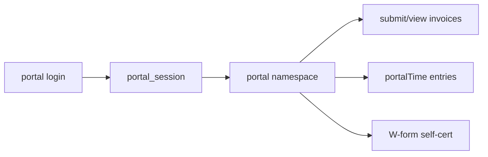

# Contractor portal (external)

## Purpose

External contractors access invoices, contracts, equipment, time, compliance uploads, and US W-form (W-9 / W-8BEN / W-8BEN-E) self-certification via separate tRPC router and cookie session.

## Flow



## Entry points

| Piece | Path |
|-------|------|
| Router root | `packages/api/src/portal-root.ts` |
| Merged portal | `packages/api/src/routers/portal/portal.ts` |
| Time | `packages/api/src/routers/portal/portal-time-router.ts` |
| W-form intake | `packages/api/src/routers/portal/portal-tax-form-router.ts` |
| Session | `packages/api/src/services/portal-session.ts` |
| Mount | `/api/trpc/portal/*` |

## W-form self-certification

The beneficial owner self-certifies a US tax form from the portal — the legally-correct signer. `getTaxFormDetermination` routes the form (W-9 vs W-8BEN/W-8BEN-E) from the contractor profile and auto-populates the treaty claim; `submitTaxForm` resolves the treaty rate, builds an immutable signed JSON snapshot (ESIGN attestation: typed name + server-derived `signedAt`/IP/`contractorId`), supersedes the prior ACTIVE row, and writes a `CONTRACTOR` audit row in one transaction. The record is append-only — only DRAFT rows are mutable; re-cert inserts a new row. The full SSN is never stored in the snapshot (last-4 only). The whole surface is gated behind the `module.us-expansion` flag (per-request `assertUsExpansionEnabled`). Staff get a read/track-only mirror (`taxForm` namespace on the staff router) — no on-behalf signing.

## UI surface

`apps/web-vite/src/components/portal/`, `pages/portal/`, `router/portal-routes.tsx`.

## Invariants

- [[patterns/portal-auth]] — not in `appRouter`
- Scoped to `ctx.contractorId` + org from validated session

## Related

- [[invoice-to-payment]]
- [[time-and-reconciliation]]
- [[equipment-logistics]]

## Verify live

```bash
semble search "portalProcedure"
ls packages/api/src/routers/portal/
```

## Agent mistakes

- Staff `tenantProcedure` in portal routers
- Adding portal to `root.ts`
