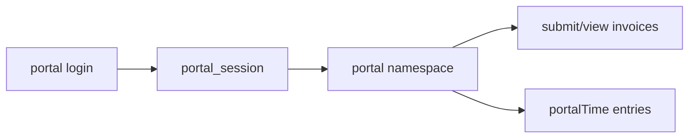

# Contractor portal (external)

## Purpose

External contractors access invoices, contracts, equipment, time, and compliance uploads via separate tRPC router and cookie session.

## Flow



## Entry points

| Piece | Path |
|-------|------|
| Router root | `packages/api/src/portal-root.ts` |
| Merged portal | `packages/api/src/routers/portal/portal.ts` |
| Time | `packages/api/src/routers/portal/portal-time-router.ts` |
| Session | `packages/api/src/services/portal-session.ts` |
| Mount | `/api/trpc/portal/*` |

## UI surface

`apps/web-vite/src/components/portal/`, `pages/portal/`, `router/portal-routes.tsx`.

## Invariants

- [[patterns/portal-auth]] — not in `appRouter`
- Scoped to `ctx.contractorId` + org from validated session

## Related

- [[invoice-to-payment]]
- [[time-and-reconciliation]]
- [[equipment-logistics]]

## Verify live

```bash
semble search "portalProcedure"
ls packages/api/src/routers/portal/
```

## Agent mistakes

- Staff `tenantProcedure` in portal routers
- Adding portal to `root.ts`
