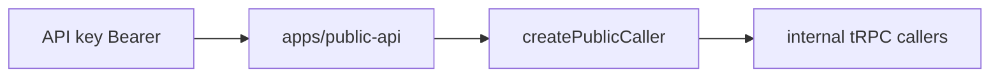

# Public API surface

## Purpose

Hono REST API (`/api/v1`) for external API-key consumers. Reuses `@contractor-ops/api` domain logic via typed callers — no duplicated business rules.

## Flow



## HTTP routes (verified)

Base path: `/api/v1` (`apps/public-api/src/app.ts`).

| Method | Path | Route file | Backend |
|--------|------|------------|---------|
| GET | `/health` | `app.ts` | Liveness (no auth) |
| GET | `/openapi.json` | `app.ts` | OpenAPI spec |
| GET | `/docs` | `app.ts` | Scalar UI (`ENABLE_API_DOCS=true`) |
| GET | `/contractors` | `routes/contractors.ts` | `contractor.list` |
| GET | `/contractors/:id` | `routes/contractors.ts` | `contractor.get` |
| GET | `/invoices` | `routes/invoices.ts` | `invoice.list` |
| GET | `/invoices/:id` | `routes/invoices.ts` | `invoice.get` |
| GET | `/contracts` | `routes/contracts.ts` | `contract.list` |
| GET | `/contracts/:id` | `routes/contracts.ts` | `contract.get` |
| GET | `/documents` | `routes/documents.ts` | `document.list` |
| GET | `/documents/:id/download-url` | `routes/documents.ts` | presigned URL |
| GET | `/feature-flags` | `routes/feature-flags.ts` | flag evaluation |

## Middleware stack

- `requestId` → `observabilityMiddleware` → `secureHeaders` → CORS allowlist (`PUBLIC_API_CORS_ORIGINS`) → `rateLimitMiddleware`
- Production: CORS env **required** — boot fails if unset

## Staff-side keys

| Piece | Path |
|-------|------|
| API key CRUD | `apiKey` tRPC router |
| Auth middleware | `packages/api/src/middleware/api-key-auth.ts` |
| Validators | `packages/validators/src/public-api/` |
| UI | [[domains/settings-and-org-admin]] |

## Invariants

- Same Zod/tenant rules as tRPC — validate at REST boundary
- `credentials: false` on CORS — Bearer header only
- No self-service key issuance on public surface

## Related

- [[patterns/validators-boundaries]]
- [[patterns/feature-flags]]
- [[domains/contractors-engagements]]
- [[domains/invoice-to-payment]]

## Verify live

```bash
ls apps/public-api/src/routes/
grep -r "app.route" apps/public-api/src/app.ts
```

## Agent mistakes

- Duplicating business rules in Hono handlers instead of `createPublicCaller`
- Permissive CORS in production
