# Public API surface

## Purpose

Hono REST API (`/api/v1`, `apps/public-api`) for external Enterprise API-key consumers. Every route delegates to `@contractor-ops/api` tRPC callers via `createPublicCaller` — **no business rule is duplicated in a Hono handler**. The whole surface ships behind a per-org `module.public-api` dark gate.

## Flow

```mermaid
flowchart LR
  client[API key Bearer] --> burst[rateLimitMiddleware ~100/min]
  burst --> hono[apps/public-api route]
  hono --> caller[createPublicCaller c]
  caller --> chain[apiKeyTenantProcedure]
  chain --> auth[apiKeyAuth]
  auth --> flag[publicApiFlagGate 404-when-off]
  flag --> tier[requireTier ENTERPRISE]
  tier --> quota[enforceApiTierQuota monthly]
  quota --> scope[requirePermission scope]
  scope --> proc[read / write procedure]
```



## Read surface (9 entities, live behind the flag)

`contractors`, `invoices`, `contracts`, `documents`, `payments`, `payment-runs`, `workflows`, `workflow-tasks`, `classifications`, `compliance-documents`, `audit-log` — all `GET` list + get-by-id (opaque cursor + bracket filter/sort). `classifications` + `audit-log` + `compliance-documents` are **read-only**.

## Write surface (6 entities — DOUBLE-DARK until Phase 100)

Built + scope-enforced + rate-limited + audited in Phase 99, but **NOT reachable**: `module.public-api` is OFF per-org AND every write `createRoute` carries `hide:true` (absent from the derived OpenAPI 3.1 doc / Scalar / SDK). The flag flip + un-hide is a **Phase-100** act after the INTEG-SEC-01 OWASP gate.

| Entity | Verbs | Scope(s) | Actor FK |
|--------|-------|----------|----------|
| contractors | create, update | `contractor:create` / `:update` | ownerUserId (opt) = actingUserId |
| invoices | create, void | `invoice:create` / `:update` | none (no user column) |
| payments | update | `payment:update` | none (PaymentRunItem) |
| payment_runs | create, transition, export | `payment:create` / `:update` / `:export` | **createdByUserId = actingUserId** |
| workflows | create, execute | `workflow:create` / `:execute` | **startedByUserId = actingUserId** |
| workflow_tasks | transition | `workflow:update` | completedByUserId (opt) = actingUserId |

DEFERRED (no procedure): `compliance_document.create` (append-only system artifact; auth grants `compliance:read` only), standalone `payment.create`, `_initiatePayoutForRun` (payout init). Write DTOs live in `packages/validators/src/public-api/` and are `.strict()` — they reject `organizationId`/`workerType`/server-derived money.

## API keys, scopes, rotation, rate limits

- **Keys** — HMAC-SHA256-hashed `co_live_*` (`api-key-service.ts`); the raw key is shown once, never stored. `apiKeyRouter` (`core/api-key.ts`) create/list/update/revoke/**rotate**/ipLog/usage under `apiKeyAdminProcedure` (organization:update + ENTERPRISE).
- **Actor model (D-01)** — each key binds a mutable, membership-guarded `actingUserId` (attribution FK, surfaced as `ctx.apiKeyActingUserId`) that fills the non-null user FKs on write-creates. **Attribution only — scopes are the sole authority.**
- **Rotation with grace** — `rotate` issues a new key inheriting name/scopes/actingUserId, supersedes the old with a bounded grace window (default 24h, max 168h); `resolveByPrefix` admits a superseded key only until `graceExpiresAt`, then hard-stops.
- **BFLA** — every write carries a mandatory `requirePermission` whose computed scope must be in `ctx.apiKeyScopes` (apiKey-mode of `rbac.ts`). See [[patterns/rbac-permissions]].
- **Rate limits** — pre-auth flat ~100/min burst (`apps/public-api/src/lib/rate-limiter.ts`) + post-auth per-tier monthly quota (`enforceApiTierQuota`; Starter 1k / Pro 10k / Enterprise unlimited). See [[patterns/rate-limit]].
- **Mutation audit** — every write emits one `writeAuditLog({actorType:'API_KEY', actorId: apiKeyId, ipAddress: sourceIp, userAgent, metadata.actingUserId})` via `routers/public-api/write-shared.ts`. See [[patterns/tenant-and-audit]].

## Developer UI

`apps/web-vite/src/components/settings/api-keys-tab.tsx` (+ `api-keys/data-table`, `api-keys/key-detail-drawer`, `rotate-api-key-dialog`, `hooks/use-api-keys-tab`) — key CRUD, last-used, source-IP log, scope visualization, acting-user rebind, rotation-with-grace, monthly usage vs quota. Enterprise-gated; the hook is the only tRPC boundary.

## Invariants

- Tenant + acting user come from the key context, never client input; `.strict()` DTOs block mass-assignment.
- Writes stay double-dark in Phase 99 — do NOT flip `module.public-api` or un-hide any route here.
- `credentials: false` on CORS — Bearer header only; production CORS env required or boot fails.

## Related

- [[patterns/rate-limit]] · [[patterns/tenant-and-audit]] · [[patterns/rbac-permissions]] · [[patterns/feature-flags]]
- [[structure/key-services]] · [[structure/api-routers-catalog]]

## Verify live

```bash
ls apps/public-api/src/routes/ packages/api/src/routers/public-api/
grep -rl "hide: true" apps/public-api/src/routes | wc -l   # 6 write-entity modules
pnpm --filter @contractor-ops/api test public-api-write-scope
```

## Agent mistakes

- Treating `actingUserId` as an authorization source — it is attribution ONLY; scopes authorize.
- Flipping `module.public-api` or un-hiding a write route in Phase 99 — that is Phase 100 (OWASP gate).
- Duplicating business rules in Hono handlers instead of reusing `createPublicCaller` + invariant helpers.
- Adding a write procedure without a mandatory `requirePermission` scope (breaks the BFLA tripwire).
