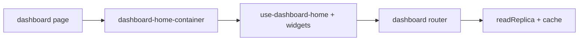

# Staff dashboard home

## Purpose

Authenticated staff landing: KPI cards, spend chart, approval queue widget, deadlines, tax obligations, activity feed — backed by `dashboard` tRPC namespace with read-replica caching.

## Flow



## Entry points

| Piece | Path |
|-------|------|
| Router | `packages/api/src/routers/core/dashboard.ts` — `fetchKpis`, widgets |
| Container | `components/dashboard/dashboard-home-container.tsx` |
| KPIs | `kpi-cards.tsx`, `hooks/use-kpi-cards.ts` |
| Spend | `spend-chart.tsx`, `hero-spend-metric.tsx` |
| Approvals | `approval-queue-widget.tsx` → [[domains/approvals-engine]] |
| Deadlines | `deadlines-widget.tsx` |
| Tax | `tax-obligations-widget.tsx` → [[domains/tax-and-wht]] |
| Activity | `activity-feed.tsx` |
| RBAC | `requirePermission({ report: ['read'] })` on reads |

## UI surface

`apps/web-vite/src/components/dashboard/` — all widget hooks colocated per [[patterns/web-vite-data-layer]].

## Invariants

- Dashboard reads use read replica + `cached`/`cachedSingleflight` — do not bypass for “quick fix”
- Widget mutations delegate to domain routers (approvals, not inline in dashboard router)
- All `dashboard.*` procedures chain `report-rate-limit` → 30/min per org (`report:${orgId}`, shared budget with `report.*`); see [[patterns/trpc-procedure-stack]]

## Related

- [[search-and-reports]]
- [[domains/approvals-engine]]
- [[structure/web-vite-domains]]

## Verify live

```bash
semble search "fetchKpis"
ls apps/web-vite/src/components/dashboard/
```

## Agent mistakes

- Adding business mutations to `dashboard` router — belongs in domain namespace
- `useTRPC` in `dashboard-home-container.tsx` instead of hooks
