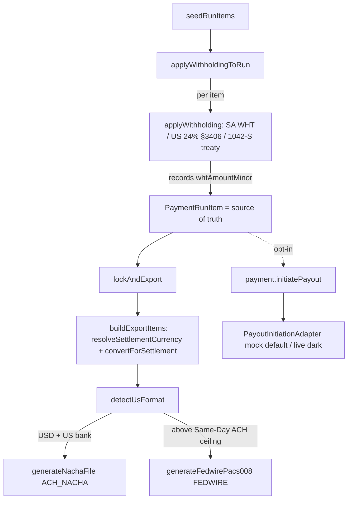

# US payment rail

> **Do not cite NACHA/Fedwire record layout or withholding rates from wiki alone.** Read the generators + `applyWithholding`.

## Purpose

The US payout rail: how US and cross-border payments settle, and where the withholding that the tax-form surface only *reports* is actually *deducted* from the payout. Adds two US export formats to the existing payment-export factory (hand-rolled NACHA ACH credit file + Fedwire ISO 20022 `pacs.008` XML), makes USD first-class with a per-payout settlement-currency choice, deducts withholding at payment-run item seeding through one jurisdiction-agnostic path, and slots the opt-in programmatic-ACH (Modern Treasury) + Plaid Identity verification behind mock-default, flag-dark seams. The whole surface is gated on `module.us-expansion` + US region.

## Flow



## Withholding: the payment run is the single source of truth

- **One jurisdiction-agnostic deduction.** `applyWithholding` (pure, per item, in `payment-shared.ts`) resolves the deduction by jurisdiction: Saudi cross-border via the unchanged `calculateWht`; US source + `Contractor.backupWithholdingFlagged` → 24% backup withholding (IRC §3406); US source + foreign recipient → the `applyTreaty` rate (30% statutory fallback). One HALF-UP round at the rate; `amountMinor = grossAmountMinor − whtAmountMinor`. Returns `null` (item untouched) for a US domestic recipient, a 0% treaty outcome, or a non-withholding jurisdiction. The SA branch is byte-preserved and regression-guarded.
- **The recorded figure is authoritative.** `applyWithholdingToRun` writes `grossAmountMinor / amountMinor / whtAmountMinor / whtRate / whtTreatyApplied / whtTreatyReference / whtServiceType` per applied item and one `payment_run.withholding_applied` audit row per applied item. The withheld figure recorded on `PaymentRunItem` **is the single source of truth**: the 1099-NEC box-4 and 1042-S box-2 aggregate the year's actual payment-run withholding — the forms never recompute the deduction. The export file carries the net.
- **The flag is a real column.** `createBackupWithholdingFlagWriter` (`tin-match.service.ts`) persists `Contractor.backupWithholdingFlagged` via a tenant-scoped idempotent `updateMany({ id, organizationId })` — the TIN never reaches the write (boolean only).

## US export formats

- **`ACH_NACHA`** — `generateNachaFile` (`payment-export.ts`) is hand-rolled on the fixed-width BACS scaffold (zero new dependency): 94-char 1/5/6/8/9 records, entry hash = Σ(first-8-digit RDFI routing) mod 10^10, balanced batch/file control totals, all-9 block padding to a multiple of 10 lines, service class 220 + SEC PPD + transaction code 22 defaults (SEC — PPD/CCD/CTX — and transaction code are parameters), per-record hard-length guard.
- **`FEDWIRE`** — `generateFedwirePacs008` emits an ISO 20022 `pacs.008.001.08` FI-to-FI customer-credit-transfer XML (Fedwire `CLRG`/`FDW` settlement block), mirroring `generateSwiftXml`. It is the message the operator hands to their bank; live FedLine transmission is a deferred bank channel (adviser-verify).
- **Routing.** `detectUsFormat(currency, isUsBank, amountMinor, ceilingMinor)` routes USD + a US bank account → `ACH_NACHA`, and above the Same-Day ACH ceiling → `FEDWIRE`. The ceiling is a dated **config** (`sameDayAchCeilingMinor(asOf)`: $1M before 2027-09-17, $10M on/after), not a baked-in constant; the routing flips at ceiling + 1.
- Both formats are additive `PaymentExportFormat` enum members + `ExportFormat` union members + a `_generateExportFileForFormat` dispatch branch (ext `txt` / `xml`).

## USD + settlement currency

- USD is a normal ECB currency (`EUR→USD` in the feed); `convertAmount` already cross-rates and short-circuits same-currency — there is **no `USD=1.0` short-circuit** (adding one would mask a genuinely missing rate on a holiday).
- `resolveSettlementCurrency({ contractorCurrency, perRunOverride? })` — the per-run override wins, else `Contractor.currency`; a blank override is treated as unset. `convertForSettlement` delegates verbatim to `convertAmount` at the payment-date ECB rate (rate 1 same-currency; `null` on a missing rate — never a silently zeroed payout). `_buildExportItems` settles each item before the buffer is built; a missing rate throws `UNPROCESSABLE_CONTENT` (`E.PAYMENT_SETTLEMENT_RATE_UNAVAILABLE`).

## Programmatic ACH + Plaid seams

- **`PayoutInitiationAdapter`** (`packages/integrations/src/adapters/payout/`) — interface + deterministic `MockModernTreasuryAdapter` (GA default, `payment_order` shape, `pending → approved → processing → sent → completed → reconciled` lifecycle) + dark `LiveModernTreasuryAdapter` + `StripeTreasuryAdapter` stub. The live SDK is referenced only in comments (lazy import inside the dark branch); the package builds with **zero external deps**.
- **`PlaidIdentityClient`** (`packages/integrations/src/adapters/plaid/`) — interface (`verify` → VERIFIED/PENDING/FAILED) + deterministic `MockPlaidIdentityClient` (GA default, advisory fail-open — an unverified status carries `advisoryWarning`, never throws/blocks) + dark `LivePlaidIdentityClient`.
- **`payment.initiatePayout`** (opt-in) — `tenantProcedure` + `requirePermission({ payment: ['export'] })` + `assertUsExpansionEnabled` + the `payments.ach-payouts` flag (dark default); `.strict()` Zod (`runId`, `idempotencyKey`, `provider`, optional `settlementCurrency`). The `_initiatePayoutForRun` helper is idempotent (Upstash reserve/complete/clear — no double-pay), reads the per-item Plaid advisory via the exact tenant-scoped `PaymentRunItem.billingProfile.plaidVerificationStatus` include (never `contractor.billingProfiles[]`), settles per item, and writes a masked-only `payment_run.payout_initiated` audit row. The NACHA/Fedwire **file** export remains the always-available GA default; programmatic init is the opt-in automation layer.

## Entry points

| Piece | Path |
|-------|------|
| Withholding deduction | `routers/finance/payment-shared.ts` — `applyWithholding`, `applyWithholdingToRun` |
| Backup-withholding flag writer | `services/tin-match.service.ts` — `createBackupWithholdingFlagWriter` |
| NACHA / Fedwire generators | `services/payment-export.ts` — `generateNachaFile`, `generateFedwirePacs008` |
| US format routing | `services/payment-format-detection.ts` — `detectUsFormat`, `sameDayAchCeilingMinor` |
| Settlement currency + FX | `services/payment-settlement.ts` — `resolveSettlementCurrency`, `convertForSettlement` |
| Export-item settlement wiring | `routers/finance/payment-shared.ts` — `_buildExportItems` |
| Opt-in payout | `routers/finance/payment-core.ts` — `payment.initiatePayout` → `_initiatePayoutForRun` |
| Payout / Plaid seams | `packages/integrations/src/adapters/payout/`, `packages/integrations/src/adapters/plaid/` |

## UI surface

No dedicated new staff screen in this rail — the payout run + lock/export flow lives under `apps/web-vite/src/components/payments/`. Any US payout/verification strings honour i18n parity (en/de/pl/ar). The Plaid advisory surfaces as a warning, not a blocking gate.

## Invariants

- **`PaymentRunItem.whtAmountMinor` is the single source of truth** for the withheld amount — forms aggregate it, never recompute.
- One withholding path for all jurisdictions (SA WHT + US §3406 24% + 1042-S treaty); SA branch preserved verbatim.
- NACHA is hand-rolled, zero-dependency; Fedwire is `pacs.008` XML, not the retired FAIM flat file.
- Same-Day ACH ceiling is dated config, not a constant.
- Settlement FX is a single HALF-UP round via `convertAmount`; a missing rate throws, never zeroes. See [[patterns/money-rounding]].
- Programmatic ACH + live Plaid are mock-behind-seam, flag-dark; Plaid is advisory fail-open. Bank routing/account are AES-256-GCM encrypted + masked-only; never logged full.
- Whole surface gated on `module.us-expansion` + US region; programmatic ACH additionally behind `payments.ach-payouts`.

## Related

- [[domains/payments-and-bank-files]]
- [[domains/tax-and-wht]]
- [[domains/us-tax-forms]]
- [[integrations/modern-treasury]]
- [[integrations/plaid]]
- [[patterns/money-rounding]]
- [[patterns/feature-flags]]

## Verify live

```bash
semble search "generateNachaFile"
semble search "applyWithholding"
semble search "detectUsFormat"
grep -n "initiatePayout" packages/api/src/routers/finance/payment-core.ts
```

## Agent mistakes

- Recomputing withholding in the 1099/1042-S forms instead of aggregating the recorded `PaymentRunItem.whtAmountMinor`.
- Adding a `USD=1.0` short-circuit — USD is already a normal ECB currency; a short-circuit would mask a missing rate.
- Baking the Same-Day ACH ceiling in as a constant instead of reading `sameDayAchCeilingMinor(asOf)`.
- Importing a third-party NACHA package — the generator is hand-rolled on purpose (supply-chain floor).
- Reading Plaid status via `contractor.billingProfiles[]` instead of the tenant-scoped `PaymentRunItem.billingProfile.plaidVerificationStatus` include.
- Treating Plaid as a hard gate — it is advisory fail-open while mocked.
