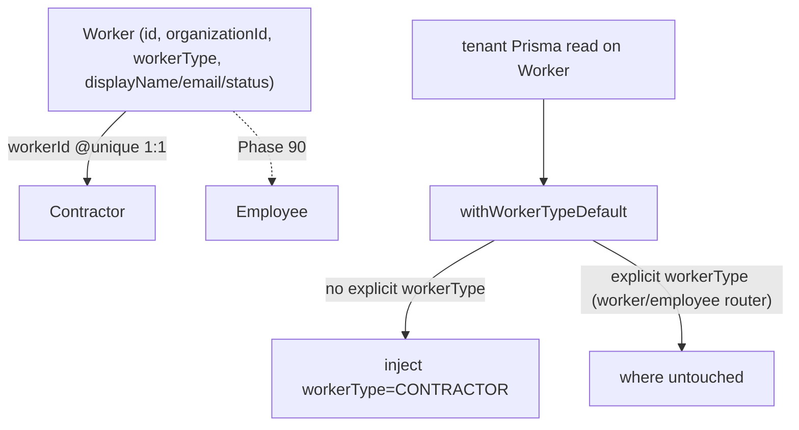

# Worker foundation (worker-model abstraction)

## Purpose

`Worker` is the identity root that lets one tenant carry both **contractors** and (from Phase 90) **employees** under a single org-scoped table, without re-keying the existing `Contractor` model. It is the serialization gate for the workforce/HR surface: contractor behaviour is preserved unchanged while a discriminated `Worker` row + a `workerType` enum open room for the employee branch. The split keeps HR-only fields, RBAC, and the `/employees` UI dark behind a flag until the employee registry lands.

## Flow



- **Worker is the identity root.** `Worker` (`worker.prisma`) holds `id`, `organizationId`, `workerType WorkerType @default(CONTRACTOR)`, shared `displayName`/`email`/`status`, soft-delete `deletedAt`, an `Organization` relation, and a `Contractor?` back-relation (with a commented `Employee?` skeleton reserved for Phase 90). It is tenant-owning and deliberately **absent from `globalModels`**, so it inherits `withTenantScope` (org scope injected on every read).
- **Contractor links via a sidecar FK, not a re-key.** `Contractor` gained `workerId String @unique` + a `worker Worker` relation; `Contractor.id` is unchanged, so the 20+ FKs that reference it are never relinked. The 1:1 link is enforced by the unique index + FK.
- **One-time additive backfill.** The link was populated by an idempotent, reversible, per-region backfill (`scripts/backfill-worker.ts`): create one `Worker` per contractor `WHERE workerId IS NULL`, set `workerId` atomically in the same `$transaction` step, batched (~100/tx on Neon's interactive-tx limit), one system-actor `worker.backfill.apply` `AuditLog` row per org. `--dry-run` writes nothing; `--rollback` nulls `workerId` then drops orphaned Workers (contractor rows are never touched).
- **Two-step migration ordering.** Migration A added the nullable column + table (additive, reversible, no FK/NOT NULL); the backfill ran; Migration B (`SET NOT NULL` + FK `REFERENCES "Worker"`) ran **last** — running B before the backfill would reject every existing null row. Both authored under `prisma/schema/migrations/__worker_*` (double-underscore = outside Prisma's timestamped applied namespace).
- **Contractor reads are `workerType`-scoped centrally.** `withWorkerTypeDefault` (`worker-type.ts`) is chained outermost in the tenant client and injects `workerType='CONTRACTOR'` on Worker reads **unless** the caller already set `workerType` (explicit-where-wins). The cross-type `worker`/`employee` routers pass an explicit `workerType`, so they bypass the default and see the type they ask for.

## Entry points

| Piece | Path |
|-------|------|
| Worker model + enum | `packages/db/prisma/schema/worker.prisma` |
| Contractor sidecar FK | `packages/db/prisma/schema/contractor.prisma` (`workerId String @unique`) |
| workerType extension | `packages/db/src/worker-type.ts` (`withWorkerTypeDefault`) |
| Backfill script | `packages/db/scripts/backfill-worker.ts` |
| Migrations | `prisma/schema/migrations/__worker_base_additive/` (A) + `__worker_id_required/` (B) |
| `worker` router | `packages/api/src/routers/core/worker.ts` (`list`, `getById`) |
| `employee` router (skeleton) | `packages/api/src/routers/core/employee.ts` (`list`, read-only) |
| Workforce flag guard | `packages/api/src/middleware/require-workforce-flag.ts` (`assertWorkforceEnabled`, `isWorkforceRegistered`) |
| Per-type RBAC | `packages/auth/src/permissions.ts` (`employee` resource) + `roles.ts` (4 HR roles) |
| Raw-SQL guard | `scripts/check-contractor-rawsql-workertype.ts` |

### Router surface

`worker.*` / `employee.*` are gated behind `module.workforce-employees` via the three-layer flag-off (see [[patterns/feature-flags]]): `root.ts` conditional-spread → `METHOD_NOT_FOUND` when off; per-request `assertWorkforceEnabled` → `FORBIDDEN` (`workforceDisabled`); web-vite `useFlag` render-removal of the `/employees` quick-link. `contractor.*` is **never** gated and its route shape is frozen by `contractor-contract-snapshot.test.ts`. Full namespace detail: [[structure/api-routers-catalog]].

### RBAC

A distinct `employee` resource (`create`/`read`/`update`/`delete`/`approve_leave`) gates HR-only fields independently of `contractor`. The 4 HR roles (`hr_admin`, `hr_manager`, `payroll_officer`, `leave_approver`) grant only `employee` (+ a narrow `contractor:read` for shared worker context) and **never** a contractor mutation (BFLA fence). `owner` does not auto-gain `employee` (it is sourced from a hand-maintained `allPermissions` duplicate). Detail: [[patterns/rbac-permissions]].

## Invariants

- **`Contractor.id` stays stable** — the abstraction is a sidecar `workerId` FK, never a re-key. Do not relink existing FKs.
- **`Worker` is tenant-owning** — never add it to `globalModels` (an IDOR landmine); `withTenantScope` must inject org scope on every Worker read. Proven by `worker-tenant-isolation.test.ts` (ORG_A never sees ORG_B Worker).
- **`workerType` lives only on `Worker`** (design A) — `Contractor` is contractor-only by table, so the contractor reads need no inline `workerType` predicate.
- **Raw `FROM "Contractor"` reads are the extension's blind spot.** The 4 known raw sites (dashboard active-contractor count, command-palette FTS, two `contractor-shared` facet reads) are contractor-only-by-table and annotated `// contractor-only-raw-sql:`. `check:contractor-rawsql-workertype` (wired into `lint:ci`) fails any NEW unannotated raw `FROM "Contractor"` read.
- **Backfill is idempotent + reversible + audited** — re-run plans zero inserts; `--rollback` restores pre-backfill state; every apply/rollback writes a system-actor `AuditLog` row (recorded against `ORGANIZATION` since `EntityType` has no `WORKER` member).
- **Migration B is LAST** — `workerId` NOT NULL + FK is applied only after the backfill links every row; the `contractor.create` sites (`contractor-core.ts`, `import.ts`, `seed-dev.ts`) create+link a `Worker` atomically so new contractors are never orphaned.

## Live state

`Worker` exists and holds one row per contractor (all `CONTRACTOR`); `Contractor.workerId` is NOT NULL + carries the `Contractor_workerId_fkey` FK → `Worker(id)`. The Employee side of the union lands with Phase 90.

## Related

- [[contractors-engagements]]
- [[structure/prisma-schema-areas]]
- [[structure/api-routers-catalog]]
- [[structure/key-services]]
- [[patterns/feature-flags]]
- [[patterns/rbac-permissions]]
- [[patterns/tenant-and-audit]]

## Verify live

```bash
semble search "withWorkerTypeDefault"
grep -n 'model Worker' packages/db/prisma/schema/worker.prisma
pnpm check:contractor-rawsql-workertype
pnpm --filter @contractor-ops/api exec vitest run worker-tenant-isolation workforce-flag contractor-contract-snapshot
```

## Agent mistakes

- Re-keying `Contractor.id` instead of adding the `workerId` sidecar FK
- Adding `Worker` to `globalModels` (breaks tenant scope — IDOR)
- A new raw `FROM "Contractor"` read without the `// contractor-only-raw-sql:` annotation (CI fails)
- Re-registering `module.workforce-employees` (already PENDING in `flags-core.ts`)
- Granting `employee` to `owner`, or letting an HR role hold a contractor mutation (BFLA fence)
- Applying Migration B before the backfill (rejects every null `workerId` row)
