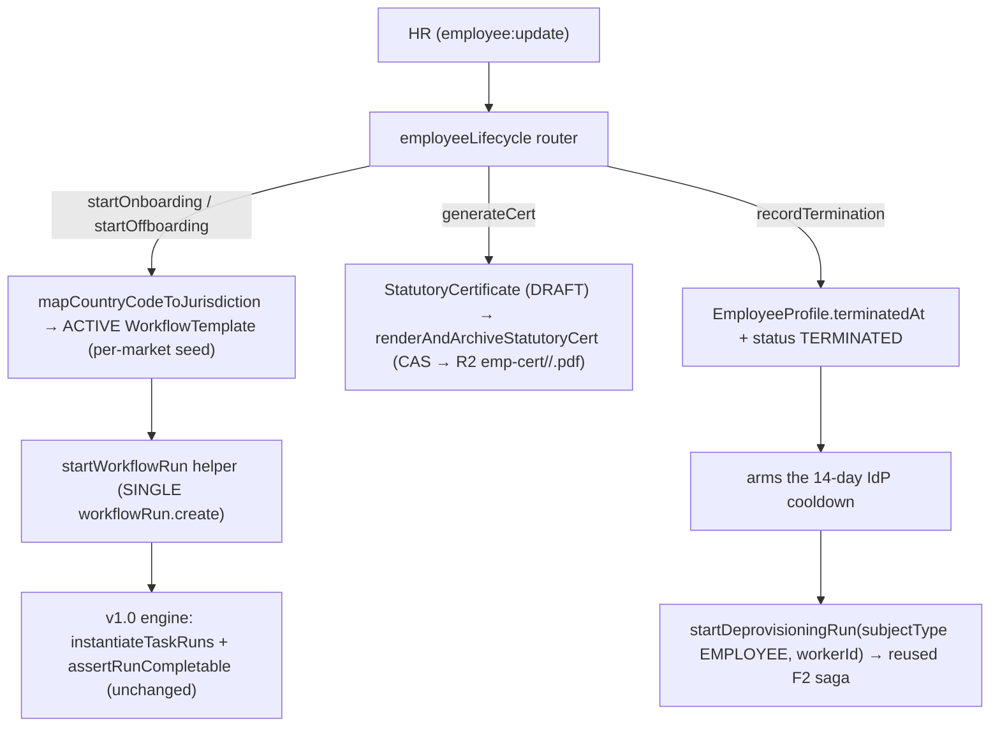

# Worker on/offboarding (employee lifecycle)

## Purpose

A new or departing `Worker(EMPLOYEE)` runs the correct per-market statutory workflow (PL / DE / UK / US) for onboarding and offboarding. The whole phase is **reuse-and-extend**: the v1.0 WorkflowRun engine, the v6.0 F4 completion gate + KT templates, the F2 IdP deprovisioning saga, the render→snapshot→R2 cert infra, and the compliance-policy jurisdiction rails are all reused — only the WorkflowRun **start path** and the DeprovisioningRun **trigger** are worker-keyed. Gated behind `module.workforce-employees` (no new flag). Local-only / legal DEFERRED: statutory certs are DRAFT + adviser-verify-watermarked; every government interaction is a network-free stub.

## Flow

## Entry points

- **tRPC** `employeeLifecycle.*` (`packages/api/src/routers/employee/employee-lifecycle-router.ts`), mounted in `workforceRouters` (`root.ts`): `get`, `startOnboarding`, `startOffboarding`, `recordTermination`, `generateCert` — all `employee`-RBAC-gated, `assertWorkforceEnabled`, tenant-scoped, audited `resourceType:'EMPLOYEE'`.
- **Worker run start** — `startWorkflowRun(tx, { subjectType:'EMPLOYEE', workerId, templateId }, …)` in `workflow-execution-runs.ts` is the ONLY `workflowRun.create`; `workflow.startRun` (discriminated-union `startRunSchema`) and the lifecycle router both delegate to it.
- **Worker deprovisioning** — `deprovisioning.startDeprovisioningRun` (`subjectType:'EMPLOYEE'|'CONTRACTOR'` union) reads `EmployeeProfile.terminatedAt` + `Worker.email`, reuses the pure `canStartDeprovisioning` gate, writes `DeprovisioningRun{ workerId, contractorId:null, assignmentId:null }`. Execution half (step runner, token resolver, adapters) untouched. `COUNTRY_TZ` gained a US entry.
- **Per-market templates** — `@contractor-ops/employee-templates` (8 seeds = 4 jurisdictions × ONBOARDING/OFFBOARDING) boot-upserted DRAFT onto `WorkflowTemplate` via `upsertEmployeeMarketTemplates` in `runPostOrganizationCreateHooks` (fail-soft).
- **Statutory certs** — `statutory-cert-pdf.ts` + 6 react-pdf templates on `statutory-cert-shell.tsx` (świadectwo pracy, PIT-11, simple Arbeitszeugnis, Lohnsteuerbescheinigung, P45, W-2). Snapshot carries `*Last4` only; CAS-guarded; LOCKED `CERT_ADVISER_VERIFY_*` watermark.
- **Gov stubs** — `{i9-everify,zus-zwua,abmeldung-sv,hmrc-rti,pit-filing}-stub.ts` return `{source:'STUB',available:false,note}` (PII last-2), no network.

## UI surface

`apps/web-vite` `employees/:workerId/lifecycle` (Page → `employee-lifecycle-container` → `use-employee-lifecycle` sole tRPC boundary → `employee-lifecycle-panel`). Start on/offboard, generate cert (download link), record termination, and the worker-keyed IdP trigger (`use-start-deprovisioning` `workerId` path + `DeprovisioningTriggerWired` `disabledReason`) — **disabled until a termination date is recorded** (the 14-day cooldown stays server-enforced). Reuses the subject-agnostic `workflows/:id` run view by runId. i18n `EmployeeLifecycle` namespace (en/de/pl/ar).

## Agent mistakes

- Do NOT duplicate `workflowRun.create` — always call the `startWorkflowRun` helper.
- Do NOT touch the IdP execution half (step runner / token resolver / `cooldown.ts` / adapters) — coupling lives only in the trigger + schema FKs.
- Statutory-cert snapshots carry `*Last4` only; the `CERT_ADVISER_VERIFY_*` strings are LOCKED const, ABSENT from `messages/*.json`.
- Seed templates are DRAFT + `assigneeRole:null` (HR roles are Better Auth org roles, not the `UserRole` enum) — the org activates + assigns on review.
- Per-region migration apply is a deferred human gate; the `__phase93_worker_lifecycle` migration is authored un-applied.
