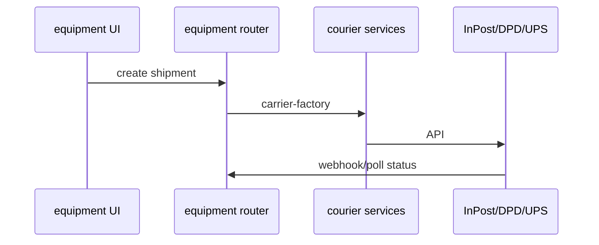

# Couriers (InPost / DPD / UPS)

## Purpose

Equipment shipment tracking via carrier APIs: label generation, status polling, webhook updates for InPost/DPD/UPS.

## Flow



## Entry points

| Piece | Path |
|-------|------|
| Factory | `packages/api/src/services/courier/carrier-factory.ts` |
| InPost | `inpost-client.ts`, `inpost-webhook-handler.ts`, `inpost-polling-service.ts` |
| DPD | `dpd-client.ts`, `dpd-polling-service.ts` |
| UPS | `ups-client.ts`, `ups-polling-service.ts` |
| Processing | `shipment-processing.ts`, `shipment-notification.ts` |
| Webhook route | `apps/api/src/routes/webhooks/inpost.ts` |
| Cron poll | `apps/cron-worker/.../inpost-status-poll.ts` |
| UI | `apps/web-vite/src/components/equipment/` |

## Invariants

- InPost webhook must **fail closed** when secret empty — [[decisions/tech-debt-hotspots]]
- Tenant-scoped shipment records

## Related

- [[domains/equipment-logistics]]
- [[framework-core]]

## Verify live

```bash
semble search "inpost-webhook-handler"
ls packages/api/src/services/courier/
```

## Agent mistakes

- Webhook verify returns true on empty secret (copy-paste hazard)
- Polling without tenant-scoped org config
