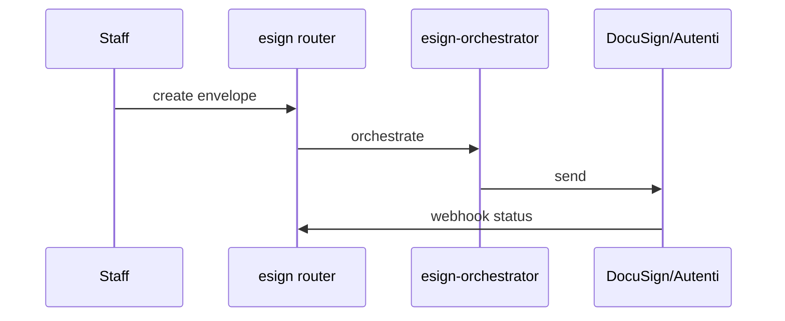

# DocuSign / Autenti e-sign

## Purpose

Electronic signature envelopes for contracts: DocuSign and Autenti adapters, orchestration, webhook status updates, void/signing progress UI.

## Flow



## Entry points

| Piece | Path |
|-------|------|
| tRPC | `esign` router |
| Orchestrator | `esign-orchestrator.ts` |
| Adapters | `docusign-adapter.ts`, `autenti-adapter.ts` |
| Webhook | `esign-webhook-handler.ts` |
| UI | `contracts/contract-detail/signing-progress-bar.tsx`, void dialog |

## Invariants

- Webhook payloads: Zod safeParse
- Contract status transitions audited

## Related

- [[domains/contracts-lifecycle]]
- [[framework-core]]

## Verify live

```bash
semble search "esign-orchestrator"
semble search "esign-webhook"
```

## Agent mistakes

- Contract ACTIVE without webhook-confirmed signature
- Skipping envelope void handling in UI state
