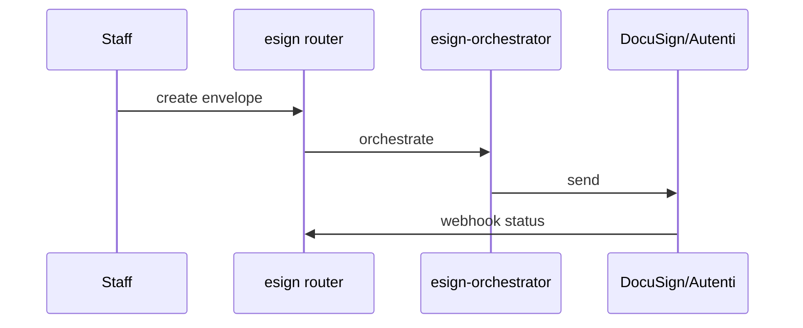

# DocuSign / Autenti e-sign

## Purpose

Electronic signature envelopes for contracts: DocuSign and Autenti adapters, orchestration, webhook status updates, void/signing progress UI.

## Flow



## Entry points

| Piece | Path |
|-------|------|
| tRPC | `esign` router |
| Orchestrator | `esign-orchestrator.ts` |
| Adapters | `docusign-adapter.ts`, `autenti-adapter.ts` |
| Webhook | `esign-webhook-handler.ts` |
| UI | `contracts/contract-detail/signing-progress-bar.tsx`, void dialog |

## Invariants

- Webhook payloads: Zod safeParse
- OAuth token responses (Autenti `exchangeCodeForTokens` / `refreshToken`): routed through `parseJsonResponse` with a token Zod schema (fail-closed) so a malformed token body never persists as a credential — same convention as the other OAuth adapters
- Contract status transitions audited
- **Completion idempotency (`handleSigningCompletion`):** guarded on the `SIGNED_PDF_SAVED` `SigningEvent` for the envelope (written in the same transaction as the signed `Document` + `SIGNED_COPY` `DocumentLink`). A redelivered "completed" webhook — or a provider firing completion more than once — returns early (existing signed `Document` for contract-linked envelopes, else `null`) without re-downloading the PDF or inserting a duplicate. `handleSigningWebhook` receives the **internal** envelope id and dedups by `providerEventId`, so a same-payload redelivery reports `completed=false`.
- **Retriable vs permanent completion failures:** `handleSigningCompletion` throws `EsignCompletionError { retriable }`. R2 upload / network failures are `retriable=true`; an envelope missing its provider external id is `retriable=false`. The webhook drain (`apps/api/.../webhooks/process.ts`) **rethrows retriable errors** (delivery → `FAILED` + 500 → QStash / reaper retry) and **swallows permanent ones** (delivery → `PROCESSED`, Sentry-captured for manual replay). Because a retry's webhook dedups to `completed=false`, the drain re-drives completion via `isSignedCopyPending(envelopeId)` (envelope terminal `COMPLETED` with no `SIGNED_PDF_SAVED` yet) — so a signed PDF lost to a transient R2 blip is actually re-saved, not silently dropped.
- **Envelope-created-before-tx (send path):** `sendForSignature` calls the provider adapter before the DB `$transaction`. DocuSign is safe on retry — `createEnvelope` sends a **deterministic** `X-DocuSign-Idempotency-Key` via `deriveIdempotencyKey({ orgId: organizationId ?? connectionId, operation: 'docusign.envelope.create', businessKey: sha256(documentName|base64.length|sorted signer emails) })`, so the same logical envelope collapses inside DocuSign's 24h window. **Autenti has no idempotency key** (multi-step `document-processes` POSTs), so a rolled-back tx would otherwise orphan the process and let a retry duplicate it.
- **Intent-row idempotency (non-idempotent providers):** every send now claims an `EsignEnvelopeIntent` row (unique `(organizationId, documentId, signerSetHash)`) **before** the provider call, where `signerSetHash = sha256(documentId | sorted(email:role:routingOrder))` mirrors the DocuSign businessKey. Flow: (a) if a row already carries `externalEnvelopeId`, short-circuit — return the persisted `SigningEnvelope` (resolved via the `(provider, externalEnvelopeId)` unique) or, if the prior local tx rolled back, re-drive **only** the persistence against the existing process (never a second provider create); (b) otherwise claim the row, call the provider, stamp `externalEnvelopeId` back onto the intent row **before** the local tx, then persist; (c) a concurrent claim raises **P2002** → resolve/reuse the winner's process, or (winner still mid-flight, no id yet) fail closed with `CONFLICT` so the caller retries rather than duplicating. Applies uniformly (DocuSign keeps its own server-side key on top). See `esign-orchestrator.ts` `computeSignerSetHash` / `reuseProviderEnvelope` / `persistEnvelopeRecords`.

## Related

- [[domains/contracts-lifecycle]]
- [[framework-core]]

## Verify live

```bash
semble search "esign-orchestrator"
semble search "esign-webhook"
```

## Agent mistakes

- Contract ACTIVE without webhook-confirmed signature
- Skipping envelope void handling in UI state
