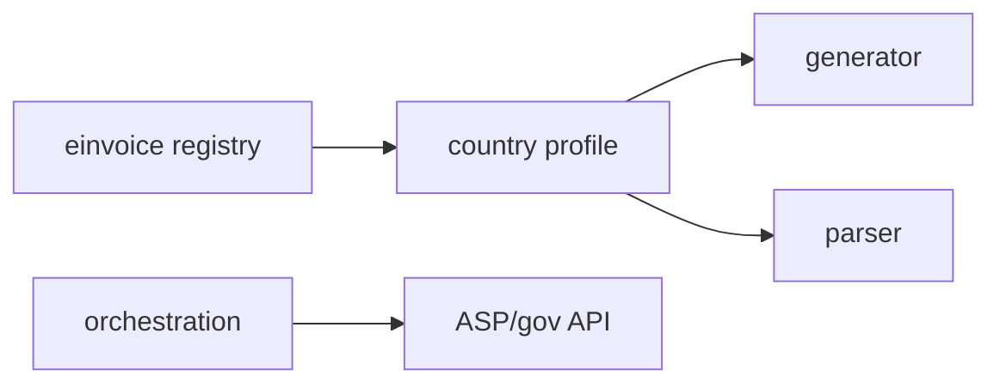

# E-invoice profiles

## Purpose

Country-specific e-invoice generation, validation, and parsing orchestrated in `packages/einvoice` — shared by intake, transmission, and compliance status UIs.

## Flow



## Entry points

| Piece | Path |
|-------|------|
| Registry | `packages/einvoice/src/registry.ts` |
| Orchestration | `packages/einvoice/src/orchestration/` |
| DE XRechnung | `profiles/xrechnung-de/` |
| DE ZUGFeRD | `profiles/zugferd-de/` |
| PL KSeF | [[ksef]] |
| SA ZATCA | [[zatca]] |
| AE Peppol | [[peppol]] |
| tRPC status | `einvoice` router |
| Intake | `invoiceIntake` router |
| Leitweg-ID | `leitwegId` router (DE public sector) |
| ECB rates | `exchangeRate` router + cron |

## UI surface

`components/einvoice/`, `components/invoices/einvoice-tab/`, settings e-invoicing.

## Invariants

- Profile selection by org jurisdiction / invoice metadata — not hardcoded in UI
- Structural validation before transmission

## Related

- [[domains/invoice-to-payment]]
- [[ksef]], [[peppol]], [[zatca]]

## Verify live

```bash
ls packages/einvoice/src/profiles/
semble search "einvoiceRouter"
```

## Agent mistakes

- Duplicating XML generation in API router instead of profile module
- Mixing intake pipeline with outbound-only profile paths
