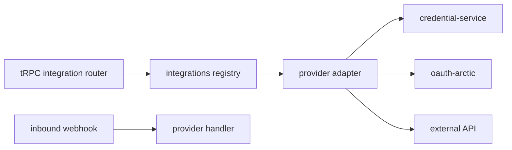

# Integration framework core

> **Do not cite adapter list from memory.** Read `register-all.ts`.

## Purpose

Unified adapter layer for OAuth providers, credential storage, token refresh, inbound/outbound webhooks, and health checks. All provider-specific routers delegate here.

## Flow



## Entry points

| Piece | Path |
|-------|------|
| Registry | `packages/integrations/src/registry.ts` |
| Base adapter | `packages/integrations/src/adapters/base-adapter.ts` |
| Register all | `packages/integrations/src/adapters/register-all.ts` |
| Credentials | `services/credential-service.ts` |
| OAuth | `services/oauth-arctic.ts` |
| Token refresh | `services/token-refresh.ts` — cron [[qstash-cron]] |
| Webhooks out | `services/webhook-dispatcher.ts` |
| Health | `services/health-service.ts` — includes parsed `scopeCapabilities` on `getProviderHealth` |
| User source (onboarding) | `services/user-source-registry.ts` — JIRA/LINEAR/GWS/SLACK directory fetch |
| Generic Slack | `integration` router + `slack-adapter.ts` |
| Inbound webhooks | `apps/api/src/plugins/webhooks.ts` |
| Multi-provider ingress | `apps/api/src/routes/webhooks/multi-provider.ts` — verify → persist `WebhookDelivery` → QStash |
| Staff UI | `apps/web-vite/src/components/integrations/` |

## UI surface

`integrations/*-provider-section.tsx`, shared hooks `use-integration-provider-section.ts` (dialog state) and `useIntegrationHealthProviderSection` (adds `scopeCapabilities` from `integration.getHealth`), status-mapping dialogs.

## Invariants

- New provider: adapter + `register-all` + tRPC router + UI section
- External JSON: `safeParse` — no bare `as` ([[patterns/validators-boundaries]])
- Webhook routes guarded — `pnpm check:webhook-routes`
- **Inbound webhook dedup = `WebhookDelivery.providerEventId`** — the ingress route persists a unique-per-delivery id from the VERIFIED payload (`WebhookVerificationResult.providerEventId`; e.g. Resend/Svix `svix-id`). DB-unique `(provider, providerEventId)` collapses a duplicate upstream delivery: the second insert hits P2002 → route 200-OKs it. Populate it only where a reliable per-event id exists — a key stable across distinct events (e.g. DocuSign `envelopeId`) would drop legitimate deliveries, so those providers leave it unset (NULLs never collide → dedup simply off).
- **QStash publish failure leaves the row `RECEIVED`** (error recorded on `lastError`), NOT `FAILED` — the row is un-processed, so the `job-health` reaper replays it on its stale-`RECEIVED` backoff. `FAILED` is reserved for terminal reaper exhaustion; flipping there at ingress would park the row forever.

## Related

- [[domains/settings-and-org-admin]]
- [[patterns/ci-guards]]

## Verify live

```bash
cat packages/integrations/src/adapters/register-all.ts
semble search "credential-service"
```

## Agent mistakes

- Provider logic duplicated outside adapter
- OAuth tokens stored outside credential-service pattern
