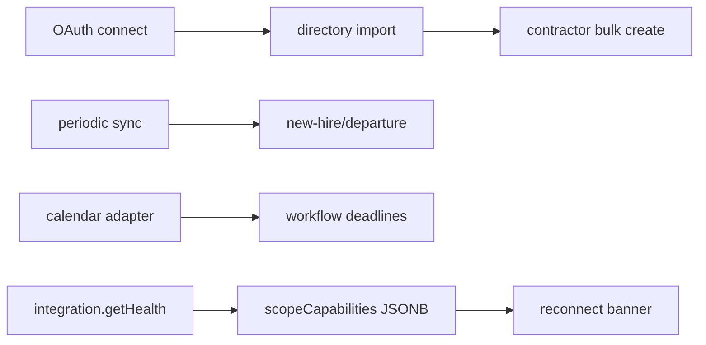

# Google Workspace

## Purpose

Admin SDK directory import, group resolution, bulk contractor import, periodic sync, new-hire/departure detection; related Google Calendar for deadline sync.

## Flow



## Entry points

| Piece | Path |
|-------|------|
| tRPC | `googleWorkspace` router |
| Adapter | `google-workspace-adapter.ts` |
| Calendar | `google-calendar-adapter.ts` + `calendar` router |
| Deprovision scopes | `google-workspace-deprovision-scopes.ts` |
| Onboarding directory | `user-source-registry.ts` — `fetchGoogleWorkspaceUsers` |
| UI section | `google-workspace-provider-section.tsx` |
| Directory wizard | `google-workspace/directory-import-wizard.tsx` |
| Sync strip | `google-workspace/sync-status-section.tsx` |
| Reconnect banner | `google-workspace-reconnect-banner.tsx` |

## Scope capabilities (reconnect banner)

| Source | `integration.getHealth({ provider: 'google_workspace' })` → `scopeCapabilities` |
| Hook | `useIntegrationHealthProviderSection` — **not** base `useIntegrationProviderSection` |
| Storage | `IntegrationConnection.scopeCapabilities` JSONB; parsed in `health-service.ts` |
| Banner | Shown when `null` or missing `user.deprovision` / `directory.write` per phase rules |

OAuth success deep-link `?google_workspace=connected` opens import wizard once; query param stripped via `replace` navigation.

## Invariants

- OAuth credentials via [[framework-core]] credential-service
- Deprovision tied to [[entra-okta-github]] / [[domains/idp-deprovisioning]] patterns
- Directory user import for onboarding shares registry with [[domains/onboarding-and-import]]

## Related

- [[domains/onboarding-and-import]]
- [[domains/workflows-and-roles]]
- [[framework-core]]

## Verify live

```bash
semble search "googleWorkspaceRouter"
semble search "fetchGoogleWorkspaceUsers"
```

## Agent mistakes

- Importing users without merge/dedup wizard flow
- Putting `scopeCapabilities` on `useIntegrationProviderSection` — health hook only
- Calendar sync without tenant-scoped connection record
