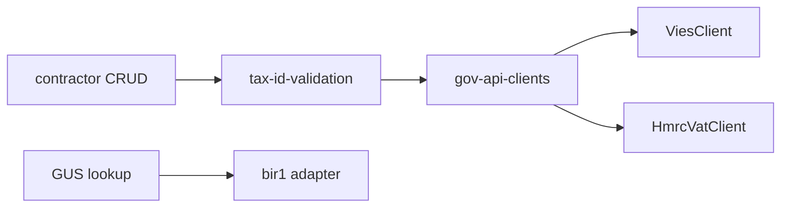

# Government APIs & company registries

## Purpose

VAT validation (VIES, HMRC), USPS address cache, Polish GUS / company registry lookups for contractor onboarding — via `@contractor-ops/gov-api` and integration adapters.

## Flow



## Entry points

| Piece | Path |
|-------|------|
| Package | `packages/gov-api/` |
| Client factory | `packages/api/src/gov-api-clients.ts` |
| Tax validation | `packages/api/src/services/tax-id-validation.service.ts` |
| Contractor shared | `routers/core/contractor-shared.ts` (USPS, VIES, HMRC) |
| BIR1 / GUS | `packages/integrations/src/adapters/bir1-company-registry-adapter.ts` |
| Dataport | `dataport-company-registry-adapter.ts` |
| tRPC tax | `tax` router |
| Secrets gap | [[infisical-secrets]] — HMRC creds stub |

## Invariants

- Rate limiting via `GovApiRateLimiter` — do not bypass
- External responses: Zod/safeParse at boundary

## Related

- [[domains/contractors-engagements]]
- [[domains/tax-and-wht]]
- [[infisical-secrets]]

## Verify live

```bash
semble search "gov-api-clients"
semble search "bir1-company-registry"
```

## Agent mistakes

- Assuming production gov credentials without Infisical wiring
- Unsafe `as` on registry API JSON responses
