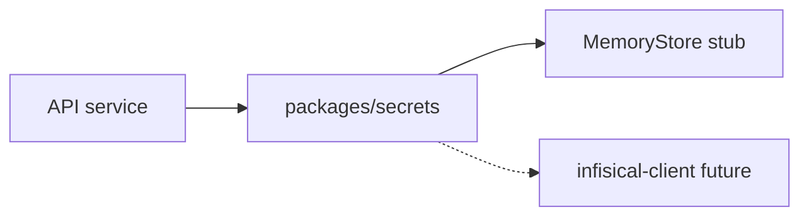

# Infisical / secrets

## Purpose

Central secret retrieval for integrations and gov-API clients. Infisical client exists; production wiring incomplete for some paths.

## Flow



## Entry points

| Piece | Path |
|-------|------|
| Client | `packages/integrations/src/services/infisical-client.ts` |
| Stub store | `packages/secrets/src/index.ts` |
| Gov API | `packages/api/src/gov-api-clients.ts` |
| Env schema | package `env.ts` files — [[patterns/validators-boundaries]] |

## Invariants

- New secrets: `.env.example` + env schema — not raw `process.env`
- **Gap:** MemoryStore in dev — do not assume prod Infisical without verification

## Related

- [[decisions/tech-debt-hotspots]]
- [[framework-core]]

## Verify live

```bash
cat packages/secrets/src/index.ts
semble search "infisical"
```

## Agent mistakes

- Assuming HMRC/gov credentials work because local tests pass
- Storing integration secrets outside credential-service pattern
