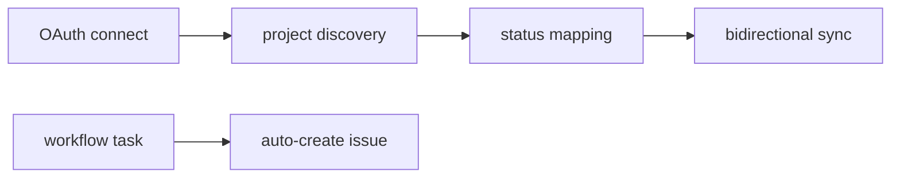

# Jira Cloud

## Purpose

Atlassian Cloud OAuth: project/issue-type discovery, status mapping, workflow task config, linked issues on contracts, bidirectional status sync, auto-issue creation from workflow tasks.

## Flow



## Entry points

| Piece | Path |
|-------|------|
| tRPC | `jira` router |
| Adapter | `jira-adapter.ts` |
| Projects client | `jira-projects-client.ts` |
| UI | `jira-provider-section.tsx`, `use-jira-provider-section.ts` |
| Contract panel | `use-linear-linked-issues-panel` pattern on contracts |

## Invariants

- Status mapping shared pattern with Linear — `integration-status-mapping.ts` (save in `$transaction`) + provider services
- Jira API list/get paths use `jiraApiGet` + Zod; status mapping entries use `workflowTaskStatusEnum`. `registerJiraWebhooks` persists `configJson.webhookSecret` (generated on first register) for HMAC verification. Inbound webhooks validate transitions, org scope, and run `unblockDependentsAndRecomputeRun` on terminal task statuses.
- `saveStatusMapping` returns `{ success, webhooksRegistered }`; web-vite shows warning toast when mapping saved but webhooks not registered (`Integrations.jira.statusMapping.toast.webhooksNotRegistered`).
- `connectionStatus` returns an allowlisted `publicJiraConfig` (`cloudId`, `siteName`, `siteUrl`, `statusMappings`, `webhookRegisteredAt`) — **never** the raw `configJson`. The HMAC `webhookSecret` + `webhookIds` are no longer projected to clients; previously any `settings:read` member could read the webhook signing secret straight out of the status payload.

## Related

- [[domains/workflows-and-roles]]
- [[domains/contracts-lifecycle]]
- [[linear]]
- [[framework-core]]

## Verify live

```bash
semble search "jiraRouter"
semble search "jira-adapter"
```

## Agent mistakes

- Hardcoded Jira status strings instead of mapped values
- Skipping OAuth token refresh path
