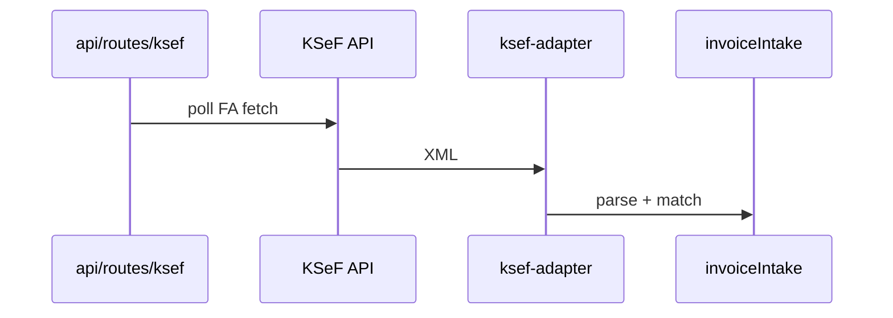

# KSeF (Poland)

> **Do not cite KSeF API behavior from wiki alone.** Verify adapter + profile code.

## Purpose

Poland National e-Invoicing System integration: fetch inbound FA(3) XML, parse to internal invoice model, duplicate detection, display KSeF references on matched invoices.

## Flow



## Entry points

| Piece | Path |
|-------|------|
| tRPC | `ksef` — `routers/integrations/ksef.ts` |
| Adapter | `packages/integrations/src/adapters/ksef-adapter.ts` |
| API client | `packages/integrations/src/services/ksef-api-client.ts` |
| Profile | `packages/einvoice/src/profiles/ksef/` |
| Sync orchestrator | `packages/api/src/services/ksef-sync-orchestrator.ts` |
| Cron routes | `apps/api/src/routes/ksef.ts` |
| Intake overlap | `invoiceIntake` router + `services/invoice-intake/` |

## UI surface

Invoice KSeF references, settings e-invoicing, contractor e-invoicing section.

## Invariants

- Token/certificate auth — not OAuth; **polling** only (`supportsWebhooks: false`)
- Tenant-scoped org credentials via framework
- **Metadata query is paginated.** `queryInvoices` returns one page plus a `hasMore` / `pageToken` cursor; `ksef-sync-orchestrator` drains every page (feeding `pageToken` into the next request) before finalizing. The sync checkpoint (`IntegrationConnection.lastSuccessAt`) advances **only** when the whole run ends with zero errors, so a mid-sync page failure — or a `hasMore` with no `pageToken` — leaves the checkpoint pinned and the window is re-queried next run. Per-invoice failures are isolated into `errors[]` (already-fetched invoices are skipped on re-query).

## Related

- [[einvoice-profiles]]
- [[domains/invoice-to-payment]]
- [[framework-core]]

## Verify live

```bash
semble search "ksefRouter"
semble search "ksef-api-client"
```

## Agent mistakes

- Expecting webhook-driven sync for KSeF
- Parsing XML without einvoice profile validators
- Consuming only `result.invoiceMetadataList` from `queryInvoices` and ignoring `hasMore` / `pageToken` — drops every invoice past page 1 while the checkpoint advances (permanent loss)
