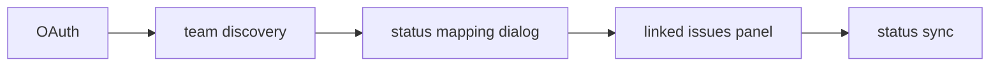

# Linear

## Purpose

Linear OAuth integration: team discovery, status mapping, task config CRUD, linked issues on engagements, bidirectional sync.

## Flow



## Entry points

| Piece | Path |
|-------|------|
| tRPC | `linear` router |
| Adapter | `linear-adapter.ts` |
| Teams client | `linear-teams-client.ts` |
| UI | `linear-provider-section.tsx`, `linear-status-mapping-dialog.tsx` |
| Shared factory | `status-mapping-factory.ts` |

## Invariants

- Same status-mapping UX pattern as [[jira]]
- Tenant-scoped connection per org

## Related

- [[domains/workflows-and-roles]]
- [[domains/contracts-lifecycle]]
- [[framework-core]]

## Verify live

```bash
semble search "linearRouter"
semble search "linear-adapter"
```

## Agent mistakes

- Duplicating status-mapping dialog logic instead of factory
- Client-side only sync without server adapter call
