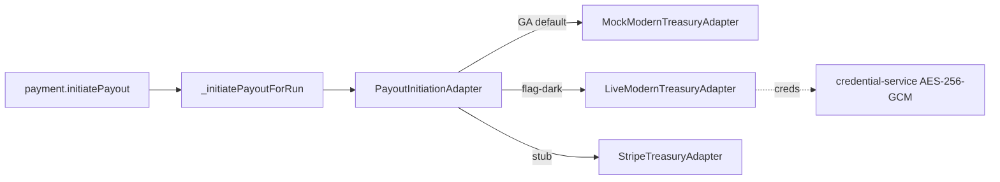

# Modern Treasury (programmatic ACH)

> **Do not cite Modern Treasury API behavior from wiki alone.** The GA path is a deterministic mock; the live originator is dark.

## Purpose

Opt-in programmatic-ACH origination for the US payout rail. Modern Treasury is the purpose-built ACH-origination / payment-ops API (bank-agnostic NACHA origination + reconciliation). It sits behind the `PayoutInitiationAdapter` seam so the always-available default stays the NACHA/Fedwire **file** export — programmatic init is the opt-in automation layer, dark until live credentials land.

## Flow



## Entry points

| Piece | Path |
|-------|------|
| Seam interface | `packages/integrations/src/adapters/payout/payout-initiation-adapter.ts` |
| GA mock (default) | `adapters/payout/mock-modern-treasury-adapter.ts` |
| Live originator (dark) | `adapters/payout/modern-treasury-adapter.ts` |
| Stripe Treasury stub | `adapters/payout/stripe-treasury-adapter.ts` |
| Seam barrel + flat compat | `adapters/payout/index.ts`, `adapters/modern-treasury-adapter.ts` |
| tRPC entry | `payment.initiatePayout` → `_initiatePayoutForRun` ([[domains/us-payment-rail]]) |
| Env keys | `packages/integrations/.env.example` |

## Invariants

- **Mock-behind-seam + flag-dark** (mirrors the tin-match seam): the GA path installs **zero external packages**; the `modern-treasury` SDK is referenced only in comments (lazy import inside the enabled branch). `MockModernTreasuryAdapter` is deterministic — the `payment_order` id derives from the idempotency key; amount/currency are echoed. Lifecycle: `pending → approved → processing → sent → completed → reconciled`.
- **Gated** — `payment.initiatePayout` requires `payment:export`, `assertUsExpansionEnabled`, and the `payments.ach-payouts` flag (default OFF, PENDING→APPROVED signoff before per-org enable). See [[patterns/feature-flags]].
- **Idempotent + audited** — Upstash reserve/complete/clear (no double-pay across pods); masked-only `payment_run.payout_initiated` audit (itemId/orderId/status/settlementCurrency/settledAmountMinor — never routing/account).
- **Credentials** — the live path resolves an AES-256-GCM blob (Org-ID + API-key) per-slug via `credential-service.getProviderEncryptionKey` (`MODERN_TREASURY_ENCRYPTION_KEY`). There is no static Zod env schema in this package by design (keyed on provider slug).

## Deferred (live path)

Live install + wiring is human-gated post-deploy: verify the SDK (name / source-repo / 7-day release-age / typosquat), install + lazy-import inside the enabled branch, flip `payments.ach-payouts`, and land AES-256-GCM credentials. `pnpm audit` + `pnpm security:scan` must be clean after any install.

## Related

- [[domains/us-payment-rail]]
- [[integrations/plaid]]
- [[integrations/framework-core]]
- [[patterns/feature-flags]]

## Verify live

```bash
semble search "PayoutInitiationAdapter"
semble search "MockModernTreasuryAdapter"
git diff HEAD -- '**/package.json'   # expect no modern-treasury dep on the GA floor
```

## Agent mistakes

- Importing the `modern-treasury` SDK at module top level — it must be a lazy import inside the dark branch so the GA path stays zero-dep.
- Enabling programmatic init without the `payments.ach-payouts` flag + US-expansion gate.
- Logging or auditing the full routing/account — only masked values and order metadata are permitted.
