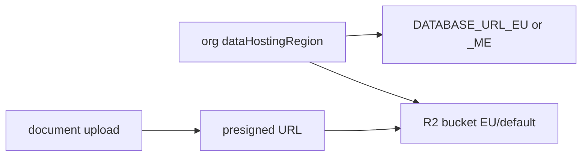

# Neon PostgreSQL + Cloudflare R2

## Purpose

Multi-region PostgreSQL (Neon EU/ME) for tenant data; Cloudflare R2 for documents, exports, classification PDFs, CMS media — with regional bucket selection per org.

## Flow



## Entry points

| Piece | Path |
|-------|------|
| DB region | `packages/db/src/region.ts` |
| Pool | `packages/db/src/client.ts` |
| Replica CB | `packages/db/src/read-replica.ts` |
| Migrations | `packages/db/scripts/migrate-all-regions.ts` |
| R2 legacy | `packages/api/src/services/r2.ts` |
| R2 regional | `regional-storage.ts` |
| Documents | `routers/core/document.ts` |
| CMS | `@payloadcms/storage-s3` in `apps/cms` |
| Guard | `pnpm check:r2-iframe-sandbox` |

## Invariants

- [[patterns/multi-region-db]] — never single-DB assumption
- Classification PDFs: content-addressed R2 ([[domains/classification-ir35]])

## Related

- [[structure/prisma-schema-areas]]
- [[domains/documents-and-ocr]]

## Verify live

```bash
semble search "regional-storage"
grep DATABASE_URL render.yaml
```

## Agent mistakes

- Uploading to wrong regional bucket for ME org
- PDF iframe without sandbox guard pass
