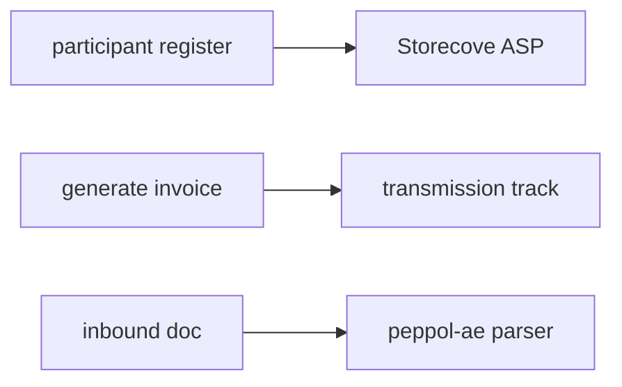

# Peppol (Gulf / AE)

## Purpose

Peppol network via Storecove ASP: participant registration, inbound/outbound transmission tracking, UAE PINT-AE compliance QR codes.

## Flow



## Entry points

| Piece | Path |
|-------|------|
| tRPC | `peppol` router |
| ASP client | `packages/einvoice/src/asp/storecove/` |
| Profile | `packages/einvoice/src/profiles/peppol-ae/` |
| Orchestrator | `packages/api/src/services/peppol-orchestrator.ts` |
| UI | `components/peppol/`, settings e-invoicing |

## Invariants

- Storecove API key per org
- VAT defaults in orchestrator — see [[decisions/tech-debt-hotspots]] if touching

## Related

- [[domains/gulf-saudization]]
- [[einvoice-profiles]]
- [[framework-core]]

## Verify live

```bash
semble search "peppolRouter"
semble search "storecove"
```

## Agent mistakes

- Hardcoding ASP credentials outside credential-service
- Skipping transmission status tracking on outbound send
