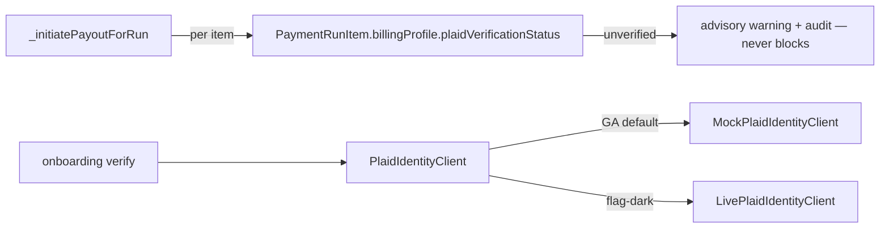

# Plaid Identity (bank verification)

> **Do not cite Plaid API behavior from wiki alone.** The GA path is a deterministic mock; the live client is dark.

## Purpose

US contractor bank-account verification at onboarding (anti-fraud), behind the `PlaidIdentityClient` seam. Verification is **advisory, fail-open**: an unverified US payout surfaces a warning but never hard-blocks — mirroring the USPS advisory posture and consistent with Plaid being mock-behind-seam + flag-dark (a mocked verification must not brick the GA payout path).

## Flow



## Entry points

| Piece | Path |
|-------|------|
| Seam interface | `packages/integrations/src/adapters/plaid/plaid-identity-client.ts` (`verify` → VERIFIED/PENDING/FAILED) |
| GA mock (default) | `adapters/plaid/mock-plaid-identity-client.ts` |
| Live client (dark) | `adapters/plaid/plaid-identity-client-live.ts` |
| Seam barrel + flat compat | `adapters/plaid/index.ts`, `adapters/plaid-adapter.ts` |
| Persisted status | `ContractorBillingProfile.plaidVerificationStatus` / `plaidVerifiedAt` / `plaidAccountId` ([[structure/prisma-schema-areas]]) |
| Payout-time advisory read | `_initiatePayoutForRun` — `PaymentRunItem.billingProfile.plaidVerificationStatus` include |
| Onboarding write trigger | `payment.verifyBillingProfilePlaid` (`routers/finance/payment-core.ts`) — the mock-triggerable mutation that *writes* the status |
| Flag | `payments.plaid-verification` (`packages/feature-flags/src/flags-core.ts`) |
| Env keys | `packages/integrations/.env.example` |

## Invariants

- **Advisory fail-open** — `MockPlaidIdentityClient` returns an `advisoryWarning` on an unverified status; `verified` carries none. The payout reads the **persisted** `plaidVerificationStatus` (set at onboarding), NOT a live per-payout Plaid call, via a tenant-scoped `PaymentRunItem.billingProfile` include (never `contractor.billingProfiles[]`). A PENDING/null status warns + audits, never throws or blocks.
- **The write path is `payment.verifyBillingProfilePlaid`** (`payment-core.ts`) — the reachable, mock-triggerable mutation that *sets* the status the payout later reads. Gated like `initiatePayout` (`payment:export` + `assertUsExpansionEnabled`) + tenant-scoped `.strict()` Zod (`billingProfileId`). It loads the profile scoped by `{ id, organizationId }` (foreign-org → NOT_FOUND, never verified), runs the mock against the profile's **masked** US routing/account + `contractor.legalName`, and persists `plaidVerificationStatus` + `plaidVerifiedAt` + `plaidAccountId`. It is itself fail-open: a non-VERIFIED result is written and returned as `{ status, advisoryWarning }` — it never throws on an unverified account and never blocks onboarding. The audit `contractor_billing_profile.plaid_verified` carries `billingProfileId` + status only (no bank data). No SDK is installed — the mock is the GA default and the live Link → `public_token` → verify flow stays flag-dark.
- **Non-gated flag** — `payments.plaid-verification` gates **only** the live client; the mock advisory default is always on. It is deliberately non-gated (the only gated payments prefix is `payments.ach-`), so it needs no signoff-registry entry and is not part of the v7.0 cohort. See [[patterns/feature-flags]].
- **Status is `String?`, not a Prisma enum** — VERIFIED/PENDING/FAILED avoids global-enum churn while the live path is dark (matches the `uspsVerified` advisory pattern).
- **Zero external deps on the GA path** — the `plaid` SDK is referenced only in comments (lazy import inside the dark branch).
- **Credentials** — the live client resolves an AES-256-GCM blob (client id + secret) per-slug via `credential-service` (`PLAID_ENCRYPTION_KEY`).

## Deferred (live path)

Live install + hard-gating is human-gated post-deploy: verify the `plaid` SDK, install + lazy-import inside the enabled branch (Link-token → public_token → `/auth/get` + `/identity/match`), flip `payments.plaid-verification`, land AES-256-GCM credentials. Hard-block-on-unverified can land once the live path is active.

## Related

- [[domains/us-payment-rail]]
- [[integrations/modern-treasury]]
- [[integrations/framework-core]]
- [[patterns/feature-flags]]

## Verify live

```bash
semble search "PlaidIdentityClient"
semble search "plaidVerificationStatus"
grep -n "payments.plaid-verification" packages/feature-flags/src/flags-core.ts
```

## Agent mistakes

- Treating Plaid as a hard gate — it is advisory fail-open while mocked; an unverified status warns, never blocks a payout.
- Reading Plaid status via `contractor.billingProfiles[]` instead of the tenant-scoped `PaymentRunItem.billingProfile.plaidVerificationStatus` include (cross-tenant leak risk).
- Adding `payments.plaid-verification` to the v7.0 cohort / signoff registry — it is intentionally non-gated.
- Importing the `plaid` SDK at module top level — the GA path must stay zero-dep.
