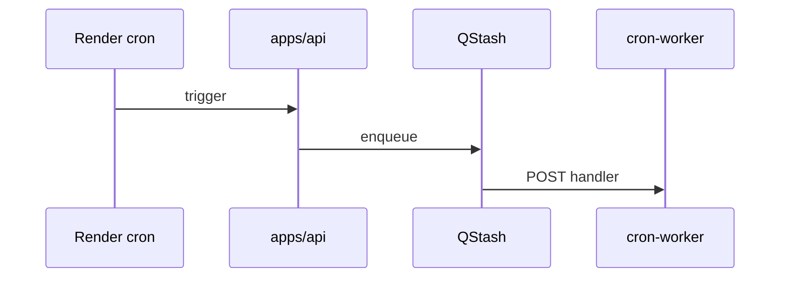

# QStash + cron worker

## Purpose

Async job delivery via Upstash QStash: deferred cron, webhook retries, background work with Zod-validated bodies and backpressure. Heavy handlers run in `apps/cron-worker`.

## Flow



## Entry points

| Piece | Path |
|-------|------|
| Verify | `apps/api/src/lib/qstash-verify.ts` |
| Route helper | `defineQStashRoute` in `qstash-route.ts` |
| Client | `packages/integrations/src/services/qstash-client.ts` |
| Backpressure | `qstash-backpressure.ts` |
| Monitor | `cron-monitor.ts` (`withQueueObservability`) |
| Handlers | [[structure/cron-jobs]] |

## Schedules

Two kinds of QStash schedule exist:

- **Per-tenant** — created inside connect procedures when an org enables an integration: KSeF (`routers/integrations/ksef.ts`), Peppol (`peppol.ts`), Google-Workspace (`google-workspace.ts`). Each stores its `qstashScheduleId` on the connection and deletes it on disconnect.
- **Global** — the transactional-outbox drain. `ensureOutboxDrainSchedule` (`apps/api/src/lib/outbox-drain-schedule.ts`) runs at API boot, upserts one schedule (fixed `scheduleId: 'outbox-drain'`, cron `* * * * *`) targeting `${API_URL}/outbox/_drain`, and asserts it by read-back. Non-fatal / skipped without `QSTASH_TOKEN`. See [[patterns/transactional-outbox]].

## Invariants

- Cron: `createCronLogger` — no `console.*`
- `cronProcedure` + `CRON_SECRET` for internal triggers
- Handler bodies validated with Zod
- Boot-time global schedules use a **fixed** `scheduleId` (upsert) so re-deploys never accumulate duplicates.
- **QStash retries are the fast path; a scheduled reconcile cron is the backstop.** When a job's per-message QStash retries can be exhausted by a longer outage (ZATCA submissions, Stripe drift), a scheduled `*-reconcile` handler re-derives the stuck rows and resettles them idempotently — see `zatca-reconcile.ts` / `stripe-reconcile.ts` in [[structure/cron-jobs]].

## Related

- [[structure/cron-jobs]]
- [[structure/apps]]
- [[framework-core]]

## Verify live

```bash
semble search "defineQStashRoute"
ls apps/cron-worker/src/jobs/handlers/
```

## Agent mistakes

- Raw cron handler without QStash signature verify
- Business logic duplicated in worker instead of `packages/api` services
