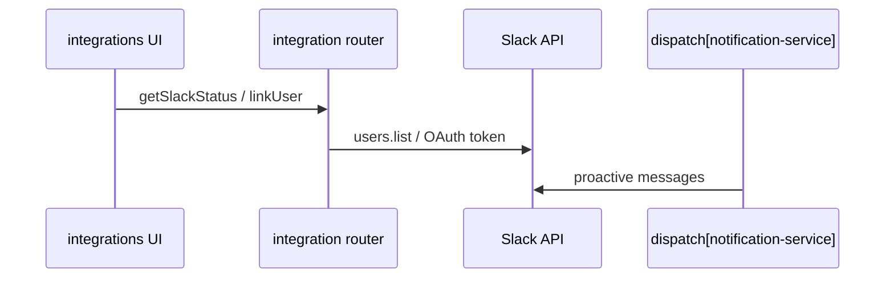

# Slack

## Purpose

Org-level Slack workspace connect, user mapping (org member ↔ Slack user), notification delivery via `SlackAdapter`, and optional Enterprise Grid org-level connection for IdP deprovisioning — separate from Microsoft Teams ([[teams]]) surface.

## Flow



## Entry points

| Piece | Path |
|-------|------|
| Workspace tRPC | `integration` router — `getSlackStatus`, `listUserMappings`, `linkUser`, `unlinkUser`, `syncUsers` |
| Org-grid tRPC | `deprovisioning` router — `connectSlackOrgGrid` (OAuth start URL), `getProviderToggleState` (connection sub-kind) |
| Client | `packages/api/src/services/slack-client.ts` |
| Adapter | `packages/integrations/src/adapters/slack-adapter.ts` |
| IdP deprov | `create-configured-deprovisionable.ts` (Slack grid token) |
| User source | `user-source-registry.ts` — `fetchSlackUsers` (cursor pagination; `fetchJsonWithTimeout`; throws on API `ok=false`) |
| Validators | `slackUserLinkSchema`, `slackUserUnlinkSchema` in `@contractor-ops/validators` |
| Dispatch | `notification-service.ts` → Slack channel |
| Org-grid UI | `apps/web-vite/src/components/settings/slack-org-grid-card.tsx` + `apps/web-vite/src/components/settings/hooks/use-slack-org-grid-card.ts` |

## Workspace bot procedures (`integration` router)

| Procedure | Permission | Notes |
|-----------|------------|-------|
| `getSlackStatus` | tenant | Returns shaped status DTO (`connected`, `displayName`, …) or `null` |
| `listUserMappings` | tenant | `{ mappings, connectionId }` — org members ↔ `SLACK_USER` external links |
| `linkUser` | `organization:update` | Creates `ExternalLink`; audit `INTEGRATION_USER_LINK` |
| `unlinkUser` | `organization:update` | Deletes link by `externalLinkId`; audit `INTEGRATION_USER_UNLINK` |
| `syncUsers` | `organization:update` | Calls `syncWorkspaceUsers` |

## Org-grid connection (Enterprise Grid)

Distinct from the workspace bot token used for notifications and onboarding user fetch.

| Piece | Detail |
|-------|--------|
| `deprovisioning.connectSlackOrgGrid` | Returns `{ url }` — local `/api/oauth/slack-org-grid/start` (single-use challenge + cookie, then Slack org-level scopes) |
| `deprovisioning.getProviderToggleState` | `providers[].connected` for `SLACK` checks `configJson.connectionSubKind === 'SLACK_ORG_GRID'` |
| `integration.getHealth({ provider: 'slack' })` | `scopeCapabilities` JSONB; UI reads optional `unavailableReason` |
| Grid unavailable signal | `scopeCapabilities.unavailableReason === 'not_on_enterprise_grid'` — disables Connect on org-grid card (`use-slack-org-grid-card.ts`) |

**UI probe split:** org-grid card uses `getProviderToggleState` for connected state (org-grid sub-kind), not `getSlackStatus` (workspace bot).

## Invariants

- Admin-only user link/unlink — `organization:update` on `integration` router
- OAuth tokens stored via `IntegrationConnection` — not raw env in UI code
- Workspace bot vs org-grid are separate connections and tokens

## Related

- [[teams]] — Teams Adaptive Cards (parallel channel)
- [[domains/notifications-and-reminders]]
- [[domains/idp-deprovisioning]]
- [[framework-core]]

## Verify live

```bash
semble search "getSlackStatus"
semble search "listUserMappings"
semble search "connectSlackOrgGrid"
semble search "SlackAdapter"
```

## Agent mistakes

- Using `listSlackUserMappings` / `linkSlackUser` — procedures are `listUserMappings`, `linkUser`, `unlinkUser`, `syncUsers`
- Duplicating Slack OAuth outside `integration` / `deprovisioning` routers
- Confusing workspace bot (`getSlackStatus`) with org-grid connection (`getProviderToggleState`)
- Confusing Slack with Teams provider UI sections
