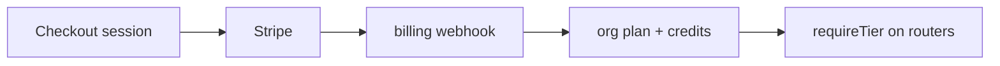

# Stripe billing

## Purpose

SaaS subscriptions: 3-tier plans, Stripe Checkout, customer portal, subscription webhooks, AI credit metering with hard-block, free trial notifications.

## Flow



## Entry points

| Piece | Path |
|-------|------|
| tRPC | `billing` router |
| Package | `packages/billing/` |
| Webhooks | `packages/billing/src/webhook/` |
| Wiring | `billing-webhook.ts`, `stripe-client.ts` |
| Landing | `apps/landing` → `@contractor-ops/billing` |
| Cron | `trial-notifications.ts` |
| UI | `components/billing/` |

## Invariants

- `requireTier` middleware on premium routers — server-side gate
- Webhook signature verification on inbound Stripe events

## Related

- [[domains/billing-and-feature-gates]]
- [[framework-core]]

## Verify live

```bash
semble search "billingRouter"
semble search "requireTier"
```

## Agent mistakes

- Feature gating only in UI without `requireTier`
- Missing webhook handler for subscription.deleted
