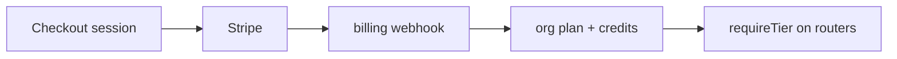

# Stripe billing

## Purpose

SaaS subscriptions: 3-tier plans, Stripe Checkout, customer portal, subscription webhooks, AI credit metering with hard-block, free trial notifications.

## Flow



## Entry points

| Piece | Path |
|-------|------|
| tRPC | `billing` router |
| Package | `packages/billing/` |
| Webhooks | `packages/billing/src/webhook/` |
| Wiring | `billing-webhook.ts`, `stripe-client.ts` |
| Landing | `apps/landing` → `@contractor-ops/billing` |
| Cron | `trial-notifications.ts`, `stripe-reconcile.ts` (daily drift repair) |
| UI | `components/billing/` |

## Invariants

- `requireTier` middleware on premium routers — server-side gate
- Webhook signature verification on inbound Stripe events
- Webhook notifications (payment-failed / trial / subscription-changed): `routeStripeEvent` collects a `NotificationEvent[]`; the route (`webhooks/stripe.ts`) enqueues each into the outbox INSIDE the Serializable tx (dedupKey `stripe:<eventId>:<i>`), not the old post-commit `dispatchStripeWebhookNotifications` — exactly-once. See [[domains/notifications-and-reminders]]
- **Event dedup + Serializable tx.** `apps/api/src/routes/webhooks/stripe.ts` upserts `StripeEvent { stripeEventId @unique }`, skips when `processedAt` is set, and processes inside one Serializable tx; 500-on-error so Stripe retries. Do not weaken these.
- **Notifications go through the outbox, in the same tx.** `routeStripeEvent` collects the `NotificationEvent[]`; the route enqueues each via `enqueueNotificationDispatch({ tx })` **inside** the Serializable tx (dedupKey `stripe:${event.id}:${i}`) rather than dispatching post-commit. A rollback discards the queued notifications with the writes; a crash after commit no longer drops a payment-failed/trial email — the drain delivers them exactly-once. `dispatchStripeWebhookNotifications` remains only as a test helper. See [[patterns/transactional-outbox]].
- **Age gate exempts state-changing events.** The 24 h late-delivery gate (`skipped: 'late_delivery'`) applies only to cosmetic/notification events. Settlement events (`SETTLEMENT_EVENT_TYPES`) **and** subscription-lifecycle events (`SUBSCRIPTION_LIFECYCLE_EVENT_TYPES`: `customer.subscription.created`/`updated`/`deleted`/`paused`/`resumed`) bypass it via `isAgeGateExempt` — Stripe retries for 3 days, so a genuinely late cancellation must still apply. `trial_will_end` stays gated (notification-only).
- **Out-of-order guard on `Subscription.lastEventCreated`.** `handleSubscriptionUpdated` (`billing-webhook.ts`) stores the source event's `created` timestamp and skips any event whose `created` predates the stored value — a delayed/redelivered STALE event can no longer clobber newer state (e.g. ACTIVE over PAST_DUE/CANCELED). Event-id dedup does not catch this (distinct delayed first-deliveries). `handleSubscriptionDeleted` also advances the watermark so a late cancellation stays sticky.
- **Daily reconcile backstop.** `stripe-reconcile.ts` (cron-worker) pages `stripe.subscriptions.list` and repairs residual status/tier drift once a day; it deliberately does not touch `lastEventCreated`. See [[structure/cron-jobs]].

## Related

- [[domains/billing-and-feature-gates]]
- [[framework-core]]
- [[patterns/transactional-outbox]]

## Verify live

```bash
semble search "billingRouter"
semble search "requireTier"
```

## Agent mistakes

- Feature gating only in UI without `requireTier`
- Missing webhook handler for subscription.deleted
