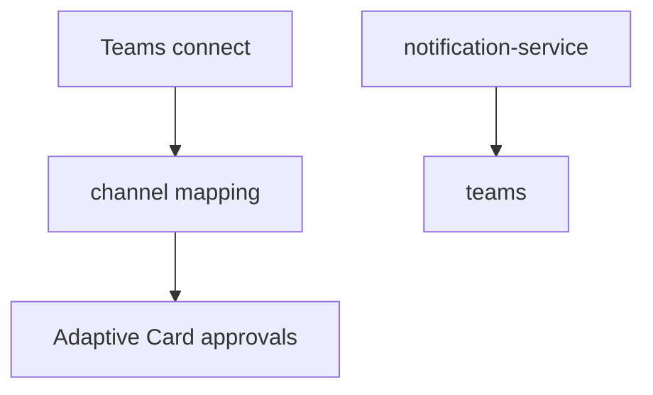

# Microsoft Teams

## Purpose

Teams: channel discovery, channel-to-workflow mapping, Adaptive Card approvals, proactive alerts. **Slack** is separate — [[slack]] via `integration` router.

## Flow



## Entry points

| Piece | Path |
|-------|------|
| tRPC Teams | `teams` router |
| Adapter Teams | `teams-adapter.ts` |
| Bot SDK | `@microsoft/agents-hosting` in `apps/api` |
| Cards | `packages/api/src/services/teams/cards/` |
| UI | `teams-provider-section.tsx`, channel mapping hooks |

## Invariants

- Approval notifications tie to [[domains/approvals-engine]]
- Dispatch errors must not silent-catch — [[decisions/tech-debt-hotspots]]
- Fallback approver dialog for unmapped channels

## Related

- [[slack]]
- [[domains/notifications-and-reminders]]
- [[framework-core]]

## Verify live

```bash
semble search "teamsRouter"
semble search "teams-adapter"
```

## Agent mistakes

- Teams mapping without fallback approver dialog handling
- Implementing Slack OAuth in Teams UI — use [[slack]]
