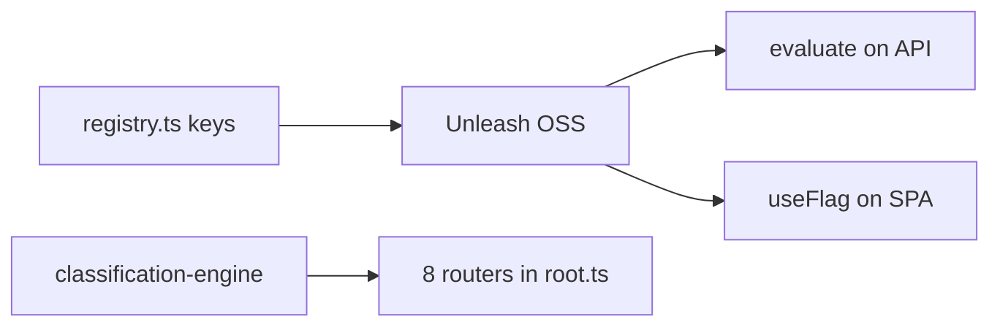

# Unleash (self-hosted OSS)

## Purpose

Self-hosted Unleash EU/ME instances gate features at runtime. Apps use `@contractor-ops/feature-flags` wrapper only — registry in code, toggles in Unleash UI.

## Flow



## Entry points

| Piece | Path |
|-------|------|
| Wrapper | `packages/feature-flags/` |
| Registry | `registry.ts`, `flags-core.ts` |
| Browser | `browser.ts` (SPA-safe) |
| tRPC | `featureFlags` router |
| Deploy | `unleash-eu`, `unleash-me` in `render.yaml` |
| Signoff | `signoff-registry-flags.ts` boot check |
| SPA context | `feature-flag-context.tsx` |

## Invariants

- **Never** Unleash SDK directly in apps — [[patterns/feature-flags]]
- `module.classification-engine` kill-switch: module load + `classificationProcedure` middleware
- Jurisdiction defaults in registry — not Prisma

## Related

- [[patterns/feature-flags]]
- [[domains/classification-ir35]]

## Verify live

```bash
grep module.classification-engine packages/feature-flags/src/registry.ts
semble search "buildFlagBag"
```

## Agent mistakes

- Flag key only in Unleash UI without registry entry
- Expecting hot-reload of classification routers without server restart
