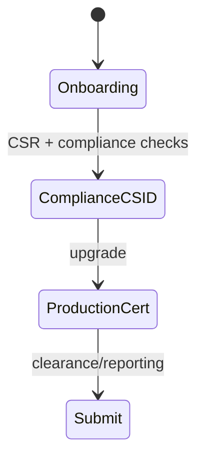

# ZATCA (Saudi Arabia)

## Purpose

ZATCA Fatoorah e-invoicing: device onboarding, CSR → compliance CSID → production certificate, clearance/reporting, QR on invoices.

## Flow



## Entry points

| Piece | Path |
|-------|------|
| tRPC | `zatca` — `routers/compliance/zatca.ts` (always mounted) |
| Profile | `packages/einvoice/src/profiles/zatca/` (generator, signer, onboarding) |
| API routes | `apps/api/src/routes/zatca.ts` |
| Status widget | `einvoice` router + `components/zatca/` |
| Signing | `profiles/zatca/signer.ts` (XML DSig) |
| Submission pipeline | `packages/api/src/services/zatca-submission.ts` |

## Invariants

- ME region tenants — [[patterns/multi-region-db]]
- Signer errors must not silent-catch — lint scope gap in einvoice package
- **A transient submission failure stays PENDING, never REJECTED.** `submitToZatca` (`services/zatca-submission.ts`) only writes REJECTED for a validation/4xx `ZatcaApiError` (`non-retryable`); a network error, timeout, 5xx/429 (`retryable`), or auth failure leaves the `ZatcaInvoiceChain` row PENDING with `submittedAt` unset — a transport failure does not mean ZATCA rejected the invoice (it may have cleared it), so it must not be branded rejected.
- **Retries reuse the chain row, never recreate it.** `ZatcaInvoiceChain.invoiceId` is `@unique`; a queued retry (or the reconcile cron) that recreated the row would P2002 in `recordChainEntry` before reaching ZATCA. When a row already exists, `submitToZatca` resubmits a PENDING one with its original `zatcaUuid` (ZATCA dedups on the uuid) and no-ops an already-settled one. The `apps/api/src/routes/zatca.ts` fast-path still skips when `submittedAt` is set.
- **The `zatca-reconcile` cron settles stranded submissions.** `reconcilePendingZatcaChains` requeries ZATCA for chains PENDING past `CRON_ZATCA_RECONCILE_STALE_MINUTES` (default 15) and resettles them — the backstop for a transient failure that outlived its QStash retries. See [[structure/cron-jobs]].

## Related

- [[domains/gulf-saudization]]
- [[einvoice-profiles]]
- [[framework-core]]

## Verify live

```bash
semble search "zatcaRouter"
ls packages/einvoice/src/profiles/zatca/
```

## Agent mistakes

- Confusing `zatca` onboarding with `einvoice` status-only reads
- Production cert before compliance CSID validation
