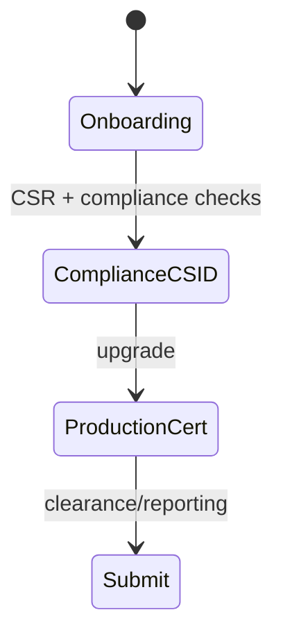

# ZATCA (Saudi Arabia)

## Purpose

ZATCA Fatoorah e-invoicing: device onboarding, CSR → compliance CSID → production certificate, clearance/reporting, QR on invoices.

## Flow



## Entry points

| Piece | Path |
|-------|------|
| tRPC | `zatca` — `routers/compliance/zatca.ts` (always mounted) |
| Profile | `packages/einvoice/src/profiles/zatca/` (generator, signer, onboarding) |
| API routes | `apps/api/src/routes/zatca.ts` |
| Status widget | `einvoice` router + `components/zatca/` |
| Signing | `profiles/zatca/signer.ts` (XML DSig) |

## Invariants

- ME region tenants — [[patterns/multi-region-db]]
- Signer errors must not silent-catch — lint scope gap in einvoice package

## Related

- [[domains/gulf-saudization]]
- [[einvoice-profiles]]
- [[framework-core]]

## Verify live

```bash
semble search "zatcaRouter"
ls packages/einvoice/src/profiles/zatca/
```

## Agent mistakes

- Confusing `zatca` onboarding with `einvoice` status-only reads
- Production cert before compliance CSID validation
