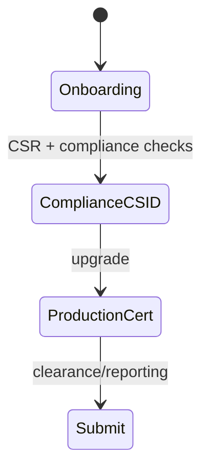

# ZATCA (Saudi Arabia)

## Purpose

ZATCA Fatoorah e-invoicing: device onboarding, CSR → compliance CSID → production certificate, clearance/reporting, QR on invoices.

## Flow



## Entry points

| Piece | Path |
|-------|------|
| tRPC | `zatca` — `routers/compliance/zatca.ts` (always mounted) |
| Profile | `packages/einvoice/src/profiles/zatca/` (generator, signer, onboarding) |
| API routes | `apps/api/src/routes/zatca.ts` |
| Status widget | `einvoice` router + `components/zatca/` |
| Signing | `profiles/zatca/signer.ts` (XML DSig) |
| Submission pipeline | `packages/api/src/services/zatca-submission.ts` |
| Post-approval trigger | `packages/api/src/services/einvoice-submission-triggers.ts` → `enqueueJob('zatca.submit')` on invoice approval when ZATCA CONNECTED |
| Invoice hash | `packages/einvoice/src/profiles/zatca/hash.ts` — C14N excl. UBLExtensions/Signature/QR; base64 to API, hex in chain |

## Invariants

- ME region tenants — [[patterns/multi-region-db]]
- Signer errors must not silent-catch — lint scope gap in einvoice package
- **Onboarding audit:** `requestComplianceCsid` and `exchangeProductionCert` emit `zatca.compliance_csid_requested` / `zatca.production_certificate_exchanged` audit rows in the same txn as config updates (`zatca-onboarding.ts` + `zatca.ts`).
- **Onboarding DB client:** all ZATCA onboarding steps called from `zatca.ts` pass `ctx.db` into `zatca-onboarding.ts` helpers so ME-region orgs hit the regional Neon DB.
- **UBL line VAT:** `buildEInvoiceFromPrisma` (`zatca-submission.ts`) uses each invoice line's `vatRate`/`vatAmountMinor` and builds a per-rate `taxBreakdown` (header `vatRate` is fallback only).
- **UBL line tax category:** `resolveZatcaLineTax` (einvoice `zatca/generator.ts`) maps a numeric `vatRate` to `ClassifiedTaxCategory` code `S` (+`cbc:Percent`) or `Z`/`Percent 0` for zero; letter codes pass through with `Z`/`E` carrying `Percent 0` (BR-Z-05/BR-E-05) and `O` omitting it (BR-O-05). Never emit the percent string into `cbc:ID`.
- **OTP required in UI (2026-07-09):** web-vite compliance CSID step collects ZATCA portal OTP before calling `zatca.requestComplianceCsid` (`compliance-csid.tsx` / `use-compliance-csid.ts`).
- **A transient submission failure stays PENDING, never REJECTED.** `submitToZatca` (`services/zatca-submission.ts`) only writes REJECTED for a validation/4xx `ZatcaApiError` (`non-retryable`); a network error, timeout, 5xx/429 (`retryable`), or auth failure leaves the `ZatcaInvoiceChain` row PENDING with `submittedAt` unset — a transport failure does not mean ZATCA rejected the invoice (it may have cleared it), so it must not be branded rejected.
- **Retries reuse the chain row, never recreate it.** `ZatcaInvoiceChain.invoiceId` is `@unique`; a queued retry (or the reconcile cron) that recreated the row would P2002 in `recordChainEntry` before reaching ZATCA. When a row already exists, `submitToZatca` resubmits a PENDING one with its original `zatcaUuid` (ZATCA dedups on the uuid). **REJECTED rows reset to PENDING** on resubmit (clears `submittedAt`/rejection fields) so a validation failure can be corrected and re-queued. The `apps/api/src/routes/zatca.ts` fast-path skips only terminal success statuses (`CLEARED`/`REPORTED`/`WARNING`), not rejected or in-flight rows.
- **The `zatca-reconcile` cron settles stranded submissions.** `reconcilePendingZatcaChains` requeries ZATCA for chains PENDING past `CRON_ZATCA_RECONCILE_STALE_MINUTES` (default 15) and resettles them — the backstop for a transient failure that outlived its QStash retries. See [[structure/cron-jobs]].

## Related

- [[domains/gulf-saudization]]
- [[einvoice-profiles]]
- [[framework-core]]

## Verify live

```bash
semble search "zatcaRouter"
ls packages/einvoice/src/profiles/zatca/
```

## Agent mistakes

- Confusing `zatca` onboarding with `einvoice` status-only reads
- Production cert before compliance CSID validation
