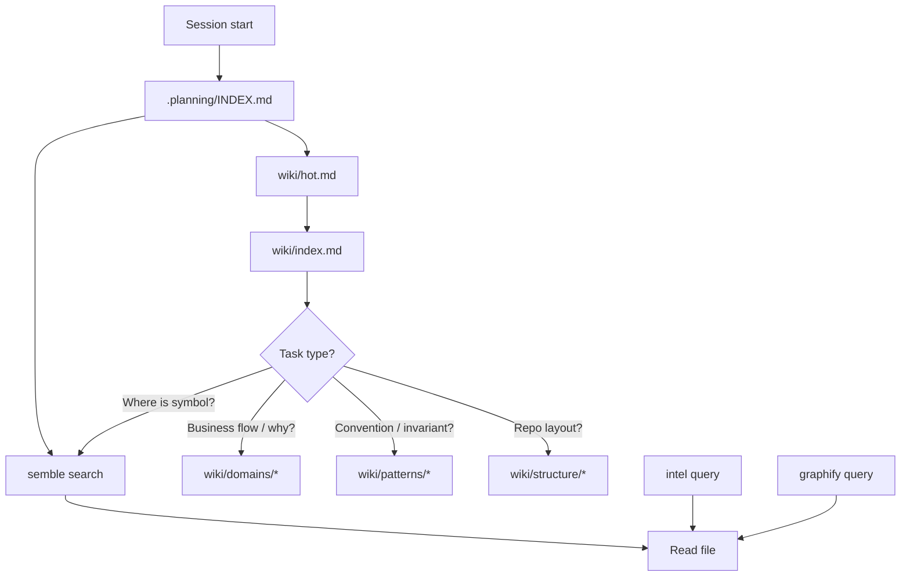

# Agent discovery protocol

> **Do not cite router counts or symbol names from this page alone.**

## Purpose

Defines the authoritative lookup order so agents orient quickly without hallucinating structure or reinventing patterns.

## Flow



## Lookup table

| Question | Source | Never alone |
|----------|--------|-------------|
| Symbol / procedure location | `semble search` → Read | wiki |
| File placement | [[structure/monorepo-topology]], `.planning/codebase/STRUCTURE.md` | guessing |
| Domain / business flow | [[domains/_index]] → specific domain | milestones bulk |
| Invariants / CI rules | [[patterns/_index]] | session memory |
| Router namespaces | [[structure/api-routers-catalog]] → `root.ts` | wiki counts |
| Live test/type status | `pnpm test`, `pnpm typecheck` | handoffs |
| Tech debt / risks | [[decisions/tech-debt-hotspots]] | stale audit |
| Call graph / paths | [[graphify]] → graphify query | wiki alone |

## Commands

```bash
semble search "<behavior>"
node .claude/get-shit-done/bin/gsd-tools.cjs intel query <term>
node .claude/get-shit-done/bin/gsd-tools.cjs graphify query <term>
pnpm check:web-vite-data-layer
pnpm typecheck --filter=@contractor-ops/api
```

## Reading order (new agent)

1. `.planning/INDEX.md` (~3 min)
2. [[overview]] → this page
3. [[structure/monorepo-topology]] + [[structure/api-routers-catalog]]
4. [[patterns/_index]]
5. [[domains/_index]] → task-specific domain
6. `semble search` before any code edit

## Documentation follows code (mandatory)

Before marking **any** product work done: wiki must track code in the **same change set**. Update domain/pattern/structure/integration pages per [[refresh-triggers]]; `CLAUDE.md` § Documentation follows code. Run `pnpm check:wiki-brain`.

## Agent mistakes

- Shipping feature/component/package code without updating wiki
- Finishing work with stale wiki/graph/intel/BM25 (doc drift)
- Citing router counts from memory — always open `packages/api/src/root.ts`
- Using wiki for symbol lookup — semble first
- Trusting cross-repo session memory (foreign emails, old counts)
- Mass-reading `.planning/milestones/**` — WIP noise
- `useTRPC` in pages/containers — see [[patterns/web-vite-data-layer]]

## Related

- [[page-template]]
- [[refresh-triggers]]
- [[decisions/memory-authority]]
