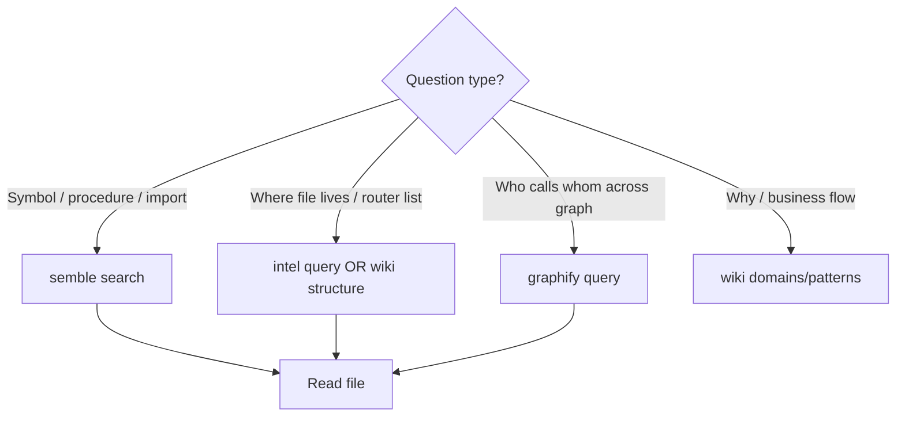

# Graphify vs semble vs intel

> **Do not cite call-graph edges from wiki alone.** Verify with semble or Read.

## Purpose

Three complementary discovery tools — pick by question type to avoid wrong tool and hallucinated paths.

## Decision flow



## Tool matrix

| Tool | Best for | Not for |
|------|----------|---------|
| **semble search** | Function names, behaviors, "where is X defined" | Domain why / product flows |
| **intel query** | JSON index: apps, routers, services, file roles | Fine-grained symbol bodies |
| **graphify query** | AST call graph paths, related modules | Natural language product docs |
| **wiki** | Flows, invariants, where-to-put-code compass | Symbol lookup without semble |
| **`.planning/codebase/*`** | Brownfield snapshot (commit pinned) | Live refactors since snapshot |

## Graphify setup (user-run)

AST-only (preferred — no semantic LLM):

```bash
graphify update . --no-cluster --force
cp graphify-out/graph.json .planning/graphs/graph.json
```

`graphify extract` runs semantic on docs and may fail without API keys — use `update` for CI/agents.

Legacy full extract (if semantic backend configured):

```bash
graphify extract . --no-cluster --out .planning/graphs
cp .planning/graphs/graphify-out/graph.json .planning/graphs/graph.json
```

Excludes: `.graphifyignore` (Prisma generated, tests, `.md`, `.planning/`).

```bash
node .claude/get-shit-done/bin/gsd-tools.cjs graphify query <term>
node .claude/get-shit-done/bin/gsd-tools.cjs intel query <term>
```

## Invariants

- Code locations: **semble first** — never wiki alone ([[agent-discovery]])
- Graph edges can be stale until user re-runs extract
- Intel `source_commit` in `_meta` — refresh after large refactors

## Related

- [[agent-discovery]]
- [[refresh-triggers]]
- [[structure/api-routers-catalog]]

## Verify live

```bash
test -f .planning/graphs/graph.json && echo "graph present" || echo "graph missing — user extract"
node .claude/get-shit-done/bin/gsd-tools.cjs intel query tenant
```

## Agent mistakes

- Using wiki for "where is function Foo"
- Trusting graphify without verifying edge in source file
- Mass-reading milestones instead of intel/wiki
