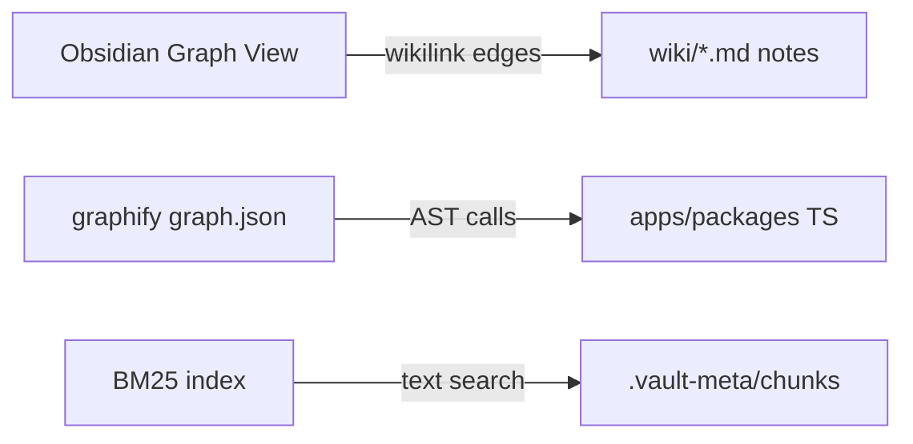

# Obsidian vault setup

## Purpose

How the brain vault connects to Obsidian **graph view**, graphify **code graph**, and agent retrieval — three separate layers.

## Three graphs (not one)



| Layer | Location | What it shows | Where to view |
|-------|----------|---------------|---------------|
| **Obsidian graph** | `wiki/**/*.md` + wikilinks | Concept/domain links between wiki pages | Obsidian → Graph view |
| **Graphify** | `.planning/graphs/graph.json` (~19k nodes) | Code call/import graph | `graphify tree`, `graphify query`, gsd-tools |
| **BM25** | `.vault-meta/bm25/` | Hybrid wiki search | `scripts/retrieve.py` |

**They are not auto-synced.** Code graph does **not** appear in Obsidian unless you export HTML separately.

## Open vault correctly

1. Obsidian → **Open folder as vault**
2. Path must be: **`.planning/brain/`** (repo-relative)
3. **Not** repo root `contractor-ops/`
4. **Not** subfolder `brain/wiki/` only

Wiki notes live under `wiki/` inside the vault. Graph filter: `path:wiki` (see `.obsidian/graph.json`).

## If graph view is empty

| Symptom | Fix |
|---------|-----|
| Opened wrong folder | Re-open vault at `.planning/brain/` |
| Graph search filter too narrow | Clear search box in Graph view; or reset filter — should be `path:wiki` not `file:f` |
| Zoomed out to nothing | Reset zoom in Graph view (filter scale was ~0.12) |
| Broken wikilinks | Use vault-root paths; run `node scripts/normalize-wiki-wikilinks.mjs` |
| `hideUnresolved` hid edges | Now `false` in `.obsidian/graph.json` — unresolved links show as dashed |

## Wikilink convention

From any page under `wiki/`, link by path from `wiki/` root:

- Good: link to `domains/invoice-to-payment` (wikilink from wiki root)
- Bad: parent-relative paths (Obsidian graph won't connect)

Hub pages for graph navigation: [[index]], [[hot]], [[meta/dashboard]], [[structure/_index]], [[domains/_index]], [[patterns/_index]], [[integrations/_index]].

**Canvas map:** [[meta/vault-map]] — visual hub layout (optional; separate from Graph view).

**Dashboard hub:** [[meta/dashboard]] (markdown — graph-connected). **Base tables:** [[meta/wiki-tables]] — `.base` files often appear as orphan nodes in Graph view; link only from `dashboard.md`.

## Refresh after wiki edits

```bash
node scripts/normalize-wiki-wikilinks.mjs   # if relative links crept in
pnpm check:wiki-brain
cd .planning/brain && find wiki -name '*.md' -exec python3 scripts/contextual-prefix.py {} --no-llm \; && python3 scripts/bm25-index.py build
```

Code graph (separate): `graphify update . --no-cluster --force` → `cp graphify-out/graph.json .planning/graphs/graph.json`

## Related

- [[graphify]]
- [[retrieval]]
- [[agent-discovery]]

## Agent mistakes

- Expecting Obsidian graph to show TypeScript call graph (that's graphify)
- Opening `wiki/` subfolder as vault — breaks `path:wiki` filters and hub paths
- Using parent-relative wikilinks — breaks Obsidian link resolution
